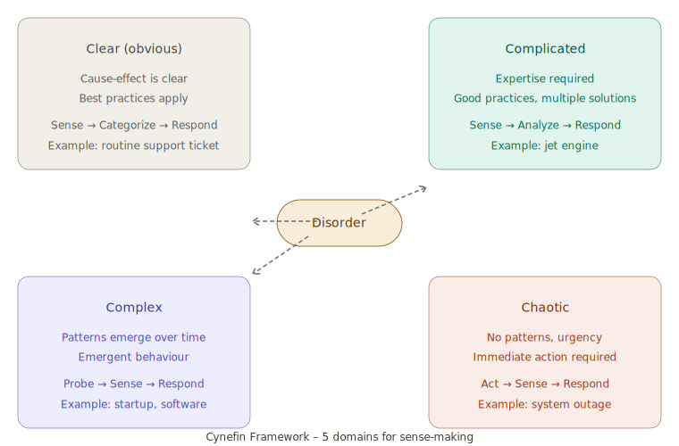

---
# 🧩 Versioning – populated automatically by the system
fm_version: "1.0.1"

# Build date – generated by script
fm_build: "2026-04-23T21:03:29.254689+00:00"

# Version comment – optional
fm_version_comment: ""


# 🆔 IDENTITY --------------------------------------------------------

# ID generated by CLI / script
id: "K000101"

# Unique UUID – generated by script
guid: "ba6374cd-3f7d-4451-95e3-2312ef23a25a"


# 🧭 CONTEXT ---------------------------------------------------------

# DAO / domain (knife, sdlc, q12, 7ds...) populated by script
dao: "knife"

# Entry title – filled in by user
title: "K000101 – CYNEFIN Framework"

# Short description – filled in by user (optional)
description: "Sense-making framework for decision-making in complex domains. Cynefin helps classify a situation according to the nature of cause-and-effect relationships and choose the appropriate course of action."


# 👥 AUTHORSHIP ------------------------------------------------------

# Primary author – from global config
author: "Roman Kazicka"

# List of authors – generated by script
authors:
  - "Roman Kazicka"


# 🗂 CLASSIFICATION ---------------------------------------------------

# Parent category – may be filled in by user
category: ""

# Document type (guide, case, tutorial...) – user (optional)
type: "guide"

# Priority (low/medium/high) – optional
priority: ""

# Tags – recommended 2–6 tags.
# Tag types:
#   - frameworks: knife, 7ds, sdlc, q12
#   - purpose: tutorial, guide, pattern, case-study
#   - topic: git, backup, ai, communication
#   - level: beginner, intermediate, advanced
tags:
  - cynefin
  - sense-making
  - complexity
  - decision-making
  - agile
  - systems-thinking


# 🌍 LOCALIZATION -----------------------------------------------------

# Document language – populated by script based on structure
locale: "en"


# 🕒 LIFECYCLE --------------------------------------------------------

# Creation date – generated by script
created: "2026-04-23 23:03"

# Date of last modification – filled in by user
modified: "2026-04-23 23:03"

# Document status – default "backlog"
status: "draft"

# Visibility – default "public"
privacy: "public"


# ⚖ INTELLECTUAL PROPERTY -------------------------------------------

# Content rights holder – populated by script
rights_holder_content: "Roman Kazicka"

# System rights owner
rights_holder_system: "CAA / KNIFE / LetItGrow"

# License
license: "CC-BY-NC-SA-4.0"

# Disclaimer
disclaimer: "Use at your own risk. Methods provided as-is; participation is voluntary and context-aware."

# Copyright
copyright: "© 2025 Roman Kazicka"


# 🔗 ORIGIN / PROVENANCE ---------------------------------------------

# Origin repository
origin_repo: ""

# Origin repository URL
origin_repo_url: ""

# Origin commit
origin_commit: ""

# Origin branch
origin_branch: ""

# Origin system (CAA/KNIFE/STHDF…)
origin_system: "CAA"

# Original author
origin_author: "Roman Kazicka"

# Imported source
origin_imported_from: ""

# Import date
origin_import_date: ""


# 🧱 RESERVED ---------------------------------------------------------

fm_reserved1: ""
fm_reserved2: ""
---

<!-- nav:knifes -->
> [⬅ KNIFES – Overview](../knifes_overview/KNIFE_Overview_Blog.md) • [List](../knifes_overview/KNIFE_Overview_List.md) • [Details](../knifes_overview/KNIFE_Overview_Details.md)

---

# Cynefin – Sense-making framework for decision-making in complex domains

<!-- fm-visible: start -->
> **GUID:** `ba6374cd-3f7d-4451-95e3-2312ef23a25a`
> **Status:** `draft` · **Author:** Roman Kazicka · **License:** CC-BY-NC-SA-4.0
<!-- fm-visible: end -->

---

## 🎯 What it solves (purpose, goal)

Cynefin helps correctly **classify a situation** based on how well we understand the cause-and-effect relationship.
Without this classification, there is a risk of applying the wrong approach – for example, planning a waterfall project
in a domain where patterns only emerge as work progresses.

**The key question Cynefin asks:**
> *In which domain am I – and what approach does that imply?*

---

## 🧩 How it solves it (principle)

<figure></figure><br/>



Cynefin defines five domains based on the nature of cause-and-effect relationships [1]:

| Domain | Character | Approach |
|---|---|---|
| **Clear** (Obvious) | Cause–effect is obvious | Sense → Categorize → Respond |
| **Complicated** | Cause exists, requires expertise | Sense → Analyze → Respond |
| **Complex** | Patterns only emerge retrospectively | **Probe → Sense → Respond** |
| **Chaotic** | No patterns, urgent action needed | Act → Sense → Respond |
| **Disorder** | You don't know which domain you're in | Classification is the first step |

**Key insight:** Most software and knowledge projects are **Complex**, not Complicated.
Complicated would mean there is an expert who knows the solution in advance.
Complex means the solution must emerge through interaction with the system [2].

---

### Domains in detail

#### Clear (Obvious)

**Clear** is the domain where the cause-and-effect relationship is **obvious to everyone** – it requires no analysis or expertise.

Approach: Sense → Categorize → Respond

1. **Sense** – perceive facts without interpretation
2. **Categorize** – fit into a known category, recognise the pattern
3. **Respond** – apply best practice, no improvisation

Examples: routine support ticket, regular backup, onboarding by checklist.

Common mistake: the team starts analysing where it isn't needed. If the situation requires analysis – you are probably in Complicated, not Clear.

> **⚠ Cliff edge:** From Clear you can fall **directly into Chaotic** – not gradually, but as a sudden drop.
> Complacency after a long period without incidents is the primary risk.
> Remedy: periodically verify whether the situation still belongs in Clear.

---

#### Complicated

**Complicated** is the domain where the cause-and-effect relationship **exists and is knowable** – but requires expertise or analysis.

Approach: Sense → Analyze → Respond

1. **Sense** – collect facts
2. **Analyze** – consult an expert, measure, diagnose, compare options
3. **Respond** – apply good practice selected for this context

| | Best practice (Clear) | Good practice (Complicated) |
|---|---|---|
| Number of solutions | One correct | Several good ones |
| Context | Context-independent | Context-dependent |
| Who decides | Anyone following SOP | Expert with judgement |

Examples: aircraft engine, tax optimisation, system architecture, surgical procedure.

Risks: expert trap, analysis paralysis, confusion with Complex.

> **Practical test:** *"If I call the best expert – can they tell us the solution in advance?"*
> Yes → Complicated. No, we need to try it → Complex.

---

#### Complex

**Complex** is the domain where the cause-and-effect relationship **cannot be known in advance** – it only emerges retrospectively from interaction with the system.

Approach: Probe → Sense → Respond

| Step | What you do | Example |
|---|---|---|
| **Probe** | Safe experiment | MVP, spike, prototype, A/B test |
| **Sense** | Observe what emerged | Retrospective, GAP review, feedback |
| **Respond** | React based on learning | Refactoring, pivot, redesign |

> A plan in the Complex domain is not a map of reality. It is a hypothesis to be tested.

Agile is designed *for* the Complex domain: Sprint = Probe, Retrospective = Sense, Refactoring = Respond.
Without Respond, Agile is just fast waterfall with a different name.

---

#### Chaotic

**Chaotic** is the domain where **no cause-and-effect relationship exists** – the system has broken down; every second without action is worse than an imperfect action.

Approach: Act → Sense → Respond

| Step | What you do | Example |
|---|---|---|
| **Act** | Stop the bleeding immediately | Rollback, shutdown, isolation |
| **Sense** | What did the action cause? | What stabilised, what is still on fire |
| **Respond** | Move to another domain | Incident review, stabilisation plan |

In Chaotic, one person decides – consensus is a luxury of stable domains.
The goal is not to solve the problem – it is to move the system from Chaotic into Complex or Complicated.

> **⚠ Most dangerous pattern:**
> Crisis → Act → stabilisation → relief → forgetting → next crisis.
> Teams that do not execute Respond after a crisis guarantee the next one – usually worse.

---

#### Disorder

**Disorder** is the state when **you don't know which domain you're in**. Classification is the first and only step.

Most conflicts in teams arise when everyone perceives the situation through a different domain – one sees Complicated, another sees Complex.

---

## 🧪 How to use it (application)

### Domain classification procedure

1. Describe the situation in one sentence.
2. Ask the question: *"Do I know the cause and effect in advance?"*
   - Yes, it is trivial → **Clear**
   - Yes, but expertise is required → **Complicated**
   - No, it will become clear later → **Complex**
   - Not at all, the system has broken down → **Chaotic**
3. Choose the approach that corresponds to the domain.

### Application in SDLC / Agile

```
Complex domain:
  Probe    →  MVP, spike, prototype
  Sense    →  retrospective, GAP review, analysis of results
  Respond  →  refactoring, redesign, plan adjustment
```

Most organisations perform Probe and Sense. **They skip Respond (refactoring)** under
business pressure – and in doing so the system gradually shifts towards Chaotic.

---

## ⚡ Quick guide (Top)

1. **Identify the domain** – Clear / Complicated / Complex / Chaotic
2. **Choose the corresponding approach** – not every situation calls for analysis, and not every situation calls for experimentation
3. **For Complex domains:** Probe → Sense → Respond (iteratively, not as a one-off)
4. **Technical debt = accumulated Respond that was not executed**
5. **Refactoring is not a punishment – it is proof that Probe worked**

---

## 📜 Detailed article

<figure></figure><br/>



### Origin and context

Cynefin was created by Dave Snowden (IBM Institute for Knowledge Management) around 1999,
originally for knowledge management in organisations [1].
The word *cynefin* comes from Welsh and means roughly "habitat" or "the place where you belong" –
a place that shapes who you are, even when you are not fully aware of it [3].

Snowden later developed it further through his company Cognitive Edge and published it in the Harvard Business Review (2007) [2].

### Why Complex is different from Complicated

This distinction is the most important practical output of Cynefin:

**Complicated:**
- An aircraft engine is complicated – but experts exist who understand it.
- You can hire an expert who will produce a plan in advance.
- Best practices work.

**Complex:**
- Ecosystem, startup, software product in a new domain, BaZi implementation.
- No expert can know in advance how the behaviour of the system will manifest in a specific context.
- Good practices replace best practices – what works elsewhere may not work here.
- Patterns only emerge from interaction [2].

### Probe → Sense → Respond in a software project

**Probe – experiment safely:**

```
MVP          →  minimal version for real users
Spike        →  time-boxed technical experiment (1–2 days)
Prototype    →  throwaway code to validate a concept
Feature flag →  new functionality for 5% of users
A/B test     →  two versions, measuring which one works better
```

**Sense – observe what emerged:**

```
Retrospective  →  what worked, what didn't, why
GAP review     →  difference between plan and reality
User feedback  →  what users actually do
Monitoring     →  logs, metrics, error rates
```

**Respond – integrate what you learned:**

```
Refactoring    →  code produced quickly is reworked properly
Pivot          →  we change direction based on user feedback
Redesign       →  architecture that doesn't fit is rewritten
Documentation  →  knowledge is recorded (KNIFE item)
```

Respond must be executed *before* the next Probe. Otherwise every sprint adds a layer on top of an untreated foundation.

### Cynefin and technical debt

Technical debt is not just "bad code". Through Cynefin it is **accumulated Respond
that was not executed**:

```
Probe  ✓   MVP was launched
Sense  ✓   problems are identified (GAP_REVIEW, DryRun outputs)
Respond ✗  business pressure, we move on without refactoring
```

Every skipped Respond increases system entropy. The system does not move into Chaotic all at once –
it erodes gradually, with every sprint without refactoring.

Business argument: *"Technical debt is interest. The longer we don't repay it, the more expensive
every further extension becomes."*

### Cynefin in practice – KnowMyself / BaZi

BaZi is a **Complex domain**:

- Even after reading all the books, you cannot know how the nuances of the domain will manifest in implementation.
- The GAP in NR names only appeared through real work, not during analysis.
- The naming convention evolved iteratively – it was not fully defined upfront.

The entire DAY refactoring cycle is an example of `Probe → Sense → Respond` in practice:

```
Probe    =  implementation of the first pillar (DAY)
Sense    =  GAP_REVIEW revealed inconsistencies
Respond  =  systematic refactoring with DryRun → Apply → Verify audit trail
```

---

## 💡 Tips and notes

- **Disorder is a dangerous domain** – most team conflicts arise when everyone
  perceives the situation through a different domain (one sees Complicated, another Complex).
- **Cynefin is not static** – a situation can move between domains.
  Unmanaged chaos can stabilise into Complex, or Complex can erode into Chaotic.
- **For agile teams:** Retrospective = Sense. Refactoring sprint = Respond.
  Without Respond, Agile is just fast waterfall with a different name.
- **Cliff edge effect** – Cynefin warns that from the Clear domain you can fall directly into Chaotic
  (not through Complicated/Complex) if you start to overestimate the system. Complacency is a risk.

---

## ✅ Value / Summary

Cynefin gives a name to something you intuitively feel when working with complex domains:
**not everything can be planned in advance – and that is not a flaw, it is a property of the domain.**

Key takeaways:

- The distinction between Complex and Complicated is the most important practical tool of the framework.
- `Probe → Sense → Respond` is the only epistemically honest approach for complex domains.
- Refactoring is **Respond** – not a correction of a mistake, but part of the learning cycle.
- Technical debt = accumulated Respond that was not executed.
- Skipping Respond under business pressure is a systematic cause of system erosion.

---

## Sources

[1] https://cynefin.io/wiki/Cynefin

[2] https://hbr.org/2007/11/a-leaders-framework-for-decision-making

[3] https://thecynefin.co/about-us/about-cynefin-framework/

---

<!-- nav:knifes -->
> [⬅ KNIFES – Overview](../knifes_overview/KNIFE_Overview_Blog.md) • [List](../knifes_overview/KNIFE_Overview_List.md) • [Details](../knifes_overview/KNIFE_Overview_Details.md)