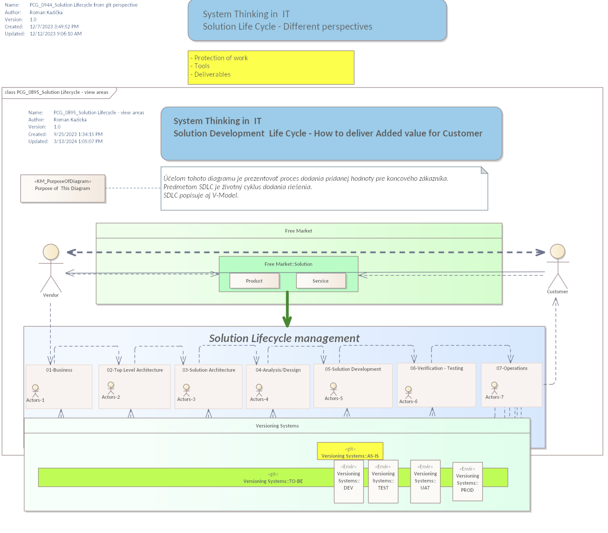
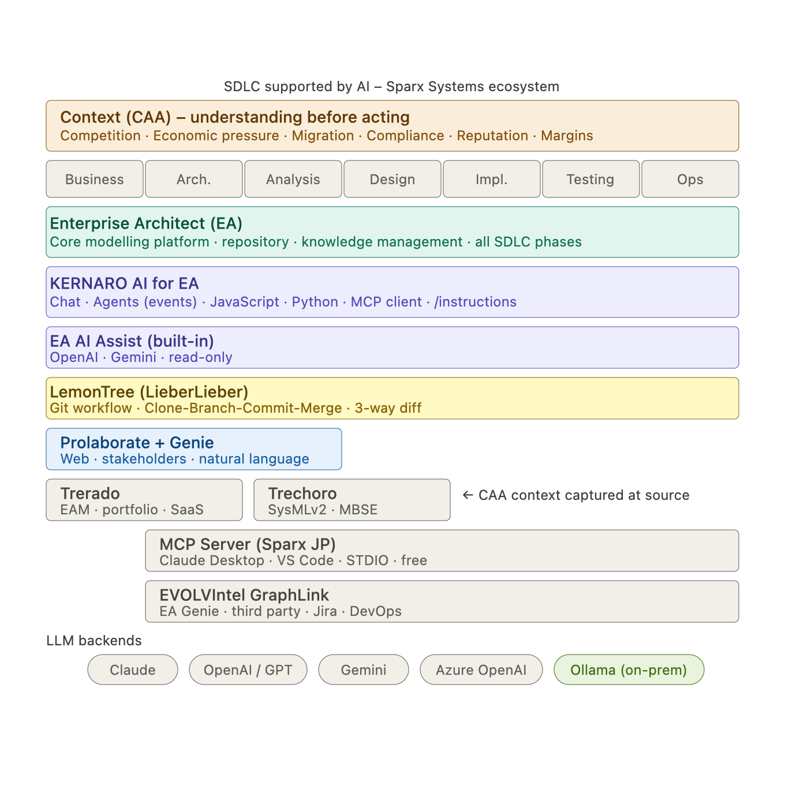
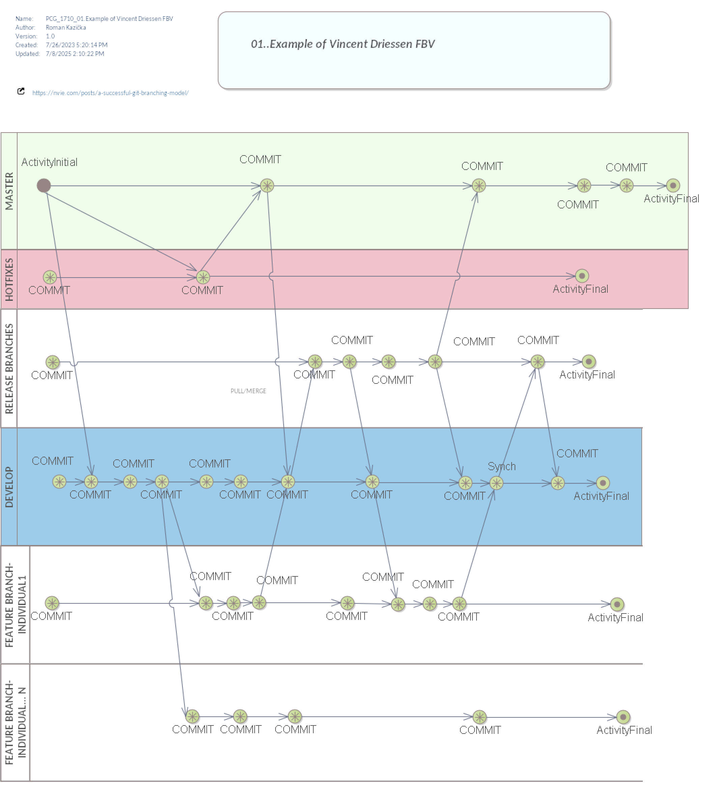
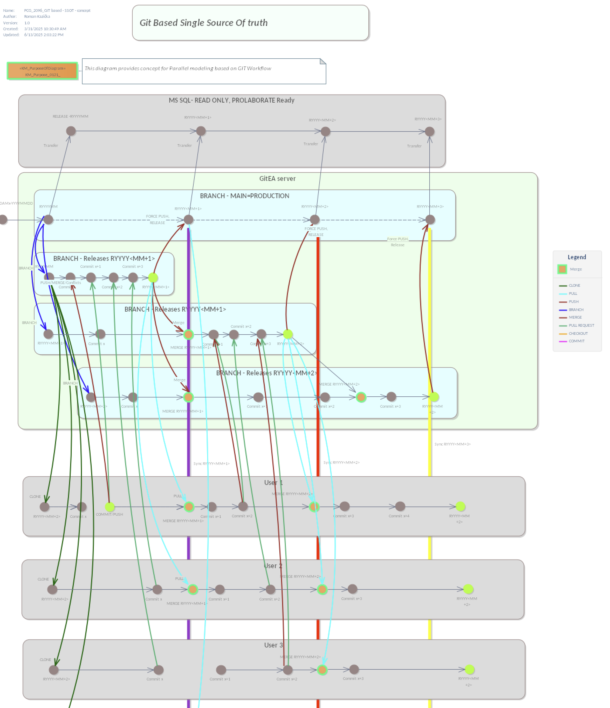
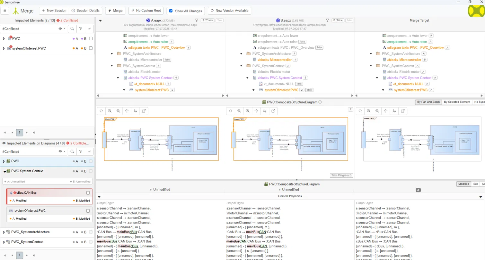
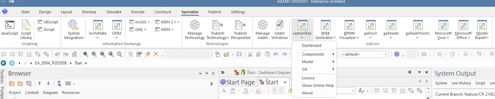
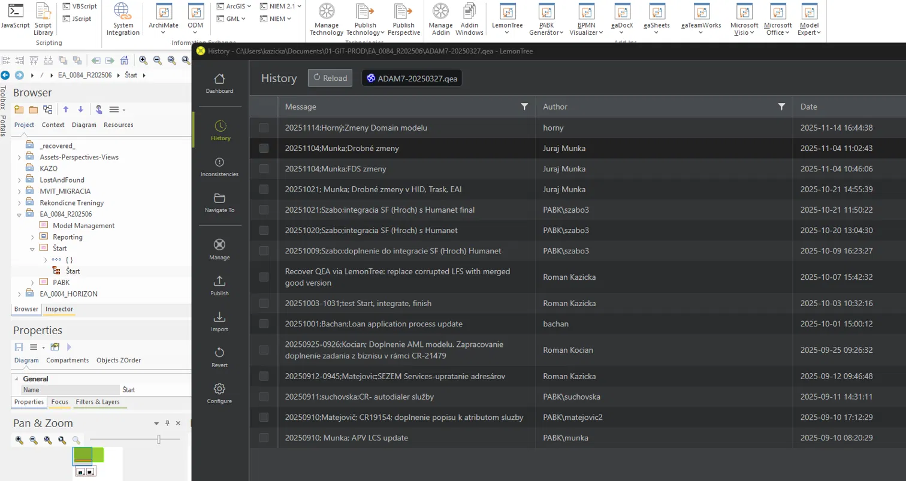
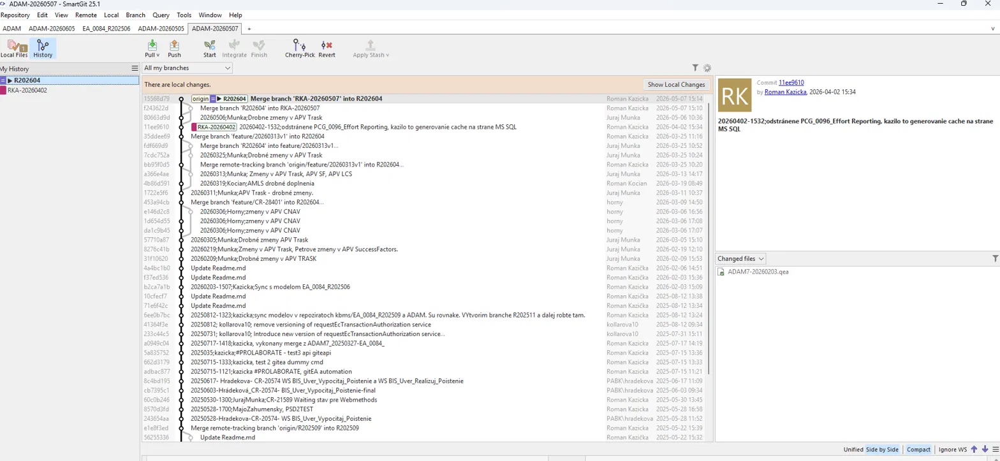

# K000110 – Time Travel in SDLC: Parallel Modelling and Version Control for Enterprise Architect

> **KNIFE** – Knowledge In Friendly Examples
> **Series:** Systemic Thinking in IT & Digital Fabrication
> **Level:** Intermediate – Advanced
> **Tags:** `SDLC` `Enterprise Architect` `LemonTree` `Git` `Version Control` `Parallel Modelling` `EAM` `MBSE`

---

## WHAT? – What is this about?

Every developer knows the feeling: something broke, you need to go back. Git makes that trivial.
Now imagine the same problem – but in a complex Enterprise Architect model. Multiple analysts. Parallel changes. No version history. No way back.

**Time travel in SDLC** means the ability to:
- See **who changed what, when, and why** – linked to a change request
- **Compare** any two model versions or releases at element level
- **Branch** – work independently without affecting the shared output
- **Merge** – integrate changes in a controlled, reviewable way
- **Roll back** – return to any point in model history

This is not a metaphor. This is a Git workflow – applied to EA models via **LemonTree** by LieberLieber.



> **Figure 01:** Solution Lifecycle Management – Git versioning in SDLC context.
> Diagram by Roman Kazicka (EA model, created 2023).
> Shows Vendor–Customer value delivery across 7 SDLC phases.
> Bottom layer: Versioning Systems – AS-IS (git, single repo) vs TO-BE
> (git across DEV / TEST / UAT / PROD environments).
> Purpose: demonstrate where Git workflow applies today and where it can be extended.

---

## HOW? – How does it work?

### The core problem with traditional EA collaboration

Enterprise Architect models are typically stored in a **central SQL database** (MySQL, Oracle, MS SQL). Every click in the model generates multiple database queries. In enterprise environments – with VPN, DLP tools, and endpoint security clients – this creates:

- **10–15 second latency per action** (experienced at 365.bank, Swiss Re, and others)
- Security systems flagging the modeller as a **potential attacker** (mass SQL queries = anomaly)
- **No parallel editing** without package locking
- **No meaningful diff** – who changed what is invisible at the element level

### The Git + LemonTree approach

LemonTree implements the whole Git workflow during parallel modelling:

```
Clone → Branch → Commit → Push → Pull Request → Merge
```



> **Figure 02:** SDLC supported by AI – Sparx Systems ecosystem overview.
> Enterprise Architect as the core modelling platform spans all SDLC phases
> (Business → Arch. → Analysis → Design → Impl. → Testing → Ops).
> LemonTree (LieberLieber) provides Git workflow: Clone–Branch–Commit–Merge, 3-way diff.
> KERNARO AI for EA adds Chat, Agents, JavaScript/Python, MCP client capabilities.
> PROLABORATE + Genie provides web access for stakeholders in natural language.
> Trerado (EAM SaaS platform) and Trechoro (SysMLv2/MBSE modelling) sit alongside Prolaborate in the broader Sparx product suite.
> LLM backends: Claude, OpenAI/GPT, Gemini, Azure OpenAI, Ollama (on-prem).

| Git concept | Meaning in EA modelling |
|---|---|
| Clone | Get a full local copy of the model |
| Branch | Create an independent working version |
| Commit | Save a named snapshot with description |
| Push | Share your version to the central Git repo |
| Pull Request | Propose your changes for review |
| Merge | Integrate changes – with conflict resolution |



> **Figure 03:** Standard Git branching model – based on Vincent Driessen's Flow-Based
> Versioning (FBV). Source: https://nvie.com/posts/a-successful-git-branching-model/
> Modelled in Enterprise Architect by Roman Kazicka.
> Branches: MASTER / HOTFIXES / RELEASE BRANCHES / DEVELOP / FEATURE BRANCH-INDIVIDUAL 1..N.
> Shows full lifecycle: ActivityInitial → commits → merges → ActivityFinal per branch.
> This is the conceptual foundation for LemonTree workflow in EA modelling.



> **Figure 04:** Git Based Single Source Of Truth – parallel modelling workflow
> for EA models. Diagram by Roman Kazicka (EA model PCG_2096, created 2025).
> Architecture: MS SQL (READ ONLY, PROLABORATE Ready) → GitEA server →
> BRANCH-MAIN=PRODUCTION → Release branches (`RYYYY<MM+1>`, `RYYYY<MM+2>`) →
> User 1 / User 2 / User 3 local clones.
> Operations shown: CLONE, PULL (cyan), PUSH (red), BRANCH (blue),
> MERGE (dark red), PULL REQUEST (green), CHECKOUT (orange), COMMIT (purple).
> This diagram is the architectural blueprint for the LemonTree implementation at 365.bank.

### What makes LemonTree different

Standard diff tools compare **text or lines**. EA models are **graphs** – elements, connectors, diagrams, tagged values, relationships.

LemonTree uses a **3-way diff algorithm** that understands the model's graph structure. It compares:
- Base version (common ancestor)
- Version A (e.g. analyst 1's branch)
- Version B (e.g. analyst 2's branch)

And produces a precise, element-level merge proposal – not a line-level text conflict.



> **Figure 05:** LemonTree merge session – three-way comparison of two parallel EA model
> branches (A.eapx vs B.eapx). Top panel: element tree with conflict markers (#Conflicted).
> Middle panel: diagram visual diff (PWC:CompositeStructureDiagram) – orange border marks
> the active/changed diagram. Bottom panel: GraphEdges diff showing renamed connector
> `mainBusCAN → cBus:CAN Bus`. Conflicts are resolved at element level, not line level.

### The latency problem – solved at the root

When the model is a **local file**, there are no real-time database queries through the corporate network. Git synchronisation is **asynchronous** – it happens when the modeller chooses to push, not on every click.

Result: no latency, no false security alerts, no blocked creativity.

*Note: the latency elimination above is specific to local-file mode. LemonTree's compare and merge engine is not limited to local files — it also supports comparing and merging directly against database-based EA repositories. Local file + Git is the configuration that removes the corporate-network bottleneck described earlier; it is not the only way LemonTree's diff/merge can be used.*

### Recommended Git client

LieberLieber recommends **SmartGit** for its tight integration between EA, LemonTree, and Git providers (GitHub, GitLab, Gitea, Azure DevOps).



> **Figure 06:** Enterprise Architect – LemonTree Add-In integrated directly in the ribbon
> (Specialize tab). Active Git branch is visible in the status bar: `feature/CR-21422`.
> The modeller works in the context of a change request without leaving EA.
> Visible menu: Dashboard / Components / Model / Git / License.

### The broader ecosystem

LemonTree integrates naturally with:

- **PROLABORATE** – web-based viewer for EA models; stakeholders see all changes without opening EA
- **KERNARO / GENIE** – AI add-ons that allow querying model content in natural language
- **LemonTree.Connect** – traceability bridge to ALM/PLM tools (requirements → architecture)

### Merge governance

Merging models should involve **one experienced user** acting as reviewer – equivalent to a Pull Request review in software development. This is not a limitation; it is **quality-controlled integration**, the same standard applied in professional dev teams.

---

## WHAT CAN YOU GAIN? – Value for you and your team

| Benefit | Detail |
|---|---|
| Full audit trail | Who changed what, when, linked to change request |
| Parallel work | Multiple analysts, zero blocking |
| Safe experimentation | Branch freely – original is never touched |
| Release comparison | Compare model state between any two releases |
| Eliminated latency | Local file, async sync – no SQL over VPN |
| Stakeholder visibility | PROLABORATE web view without EA licence |
| AI-ready foundation | KERNARO/GENIE work on top of a clean, versioned model |



> **Figure 07:** LemonTree History panel inside Enterprise Architect – complete Git history
> of model file `ADAM7-20250327.qea`. Each record includes author, date, and change
> description linked to a change request or system (CR-21479, APV LCS, AML model).
> Multiple authors visible: Juraj Munka, Roman Kocian, PABK\szabo3, Roman Kazicka,
> bachan, PABK\suchovska, PABK\matejovic2.
> Commit `Recover QEA via LemonTree` documents a real file recovery operation –
> possible only because of Git version history.

### Why this matters before you even touch Git: the QRM angle

Reducing lead time is not just a Git problem – it is a [K000108 (Quick Response Manufacturing)](../K000108-QRM/index.md) problem applied to modelling work. Every blocked analyst, every 15-second click, every "wait for the lock to release" is dead time in the model's critical path. Grasped in the right CAA context, Git workflow for EA is a lead-time reduction lever, not just a developer-tooling nicety.

<!-- 📸 05-qrm-business: business framing, link to K000108 QRM / Rajan Suri MCT -->

### Real-world reference

**365.bank** (Slovakia) – running LemonTree + Git since **2021**. Full parallel modelling workflow, change-request-linked history, release comparisons.

**Versicherungskammer Bayern / VKB** (Germany, ~7,500 employees) – introduced LemonTree for parallel development of complex insurance products in Enterprise Architect. Published by LieberLieber, May 2026.



> **Figure 08:** SmartGit – production Git history of Enterprise Architect model repository
> at 365.bank. Multiple authors working in parallel branches (R202604, RKA-20260402).
> Each commit message references a specific change request (CR-28401, CR-20574, APV Trask).
> Changed file: `ADAM7-20260203.qea` — the EA model binary tracked directly in Git.
> Notable: commit `Recover QEA via LemonTree: replace corrupted LFS with merged good version`
> — a real recovery operation enabled by Git history.
> This is a live production environment, running since 2021.

Both cases confirm: this is not an experiment. It is **production-grade** model version control.

---

## Summary

Git changed how developers collaborate on code.
LemonTree brings the same discipline to **model-based engineering**.

The combination of local files, async Git sync, 3-way diff, and structured merge review gives modelling teams what developers have had for decades:
**a complete, auditable, reversible history of their work.**

In regulated industries – banking, insurance, energy – this is not a nice-to-have.
It is a foundation for **trustworthy, scalable SDLC**.

---

## Reflection Questions

*For students: write down your answer before reading further or discussing with others.*
*For practitioners: use these as a team discussion starter.*

1. **Your team uses EA with a shared SQL database.** You need to model two parallel scenarios for a change request – one conservative, one experimental. How would you handle this today? What are the risks?

2. **A senior analyst made a major structural change to the model three weeks ago.** Your project manager asks: "Can you show me exactly what changed and why?" How would you answer that question with your current tooling – and how long would it take you?

3. **You are about to introduce LemonTree in your organisation.** Who needs to be involved in defining the Git workflow? What resistance do you expect – and from whom?

4. **The merge step requires a senior reviewer.** What would have to change for merge review to feel like a bottleneck instead of a quality gate on your team? How does your answer change depending on team size and project phase?

5. **LemonTree eliminates latency by keeping the model local.** What other risks or constraints does a local file introduce in your organisation's security policy? How would you address them?

6. **"Time travel" in models means you can return to any past state.** Describe a real situation in your project where this capability would have saved time, money, or avoided a mistake.

---

## Related KNIFE Articles

- [K000108 – Quick Response Manufacturing (QRM)](../K000108-QRM/index.md) – lead-time reduction; the business case behind eliminating blocked/waiting time in modelling work
- [K000104 – SPARX AI KERNARO in SDLC](../K000104-SPARX_AI_KERNARO_IN_SDLC/index.md) – KERNARO/GENIE AI layer that LemonTree's versioned model feeds into

## List of Figures

| Figure | Section | Description | Image |
|---|---|---|---|
| Figure 01 | WHAT | Solution Lifecycle Management – Git versioning in SDLC context | [02-SDLC-GIT.png](img/02-SDLC-GIT.png) |
| Figure 02 | HOW – The Git + LemonTree approach | Sparx Systems AI ecosystem overview | [01-sparx-ecosystem.png](img/01-sparx-ecosystem.png) |
| Figure 03 | HOW – The Git + LemonTree approach | Standard Git branching model (Vincent Driessen FBV) | [03-GIT-std-workflow.png](img/03-GIT-std-workflow.png) |
| Figure 04 | HOW – The Git + LemonTree approach | Git Based Single Source of Truth – parallel modelling blueprint | [04-GIT-release-workflow.png](img/04-GIT-release-workflow.png) |
| Figure 05 | HOW – What makes LemonTree different | LemonTree 3-way diff merge session | [05-Lemontree.png](img/05-Lemontree.png) |
| Figure 06 | HOW – Recommended Git client | LemonTree Add-In in the EA ribbon | [07-EA-LT-01.png](img/07-EA-LT-01.png) |
| Figure 07 | WHAT CAN YOU GAIN | LemonTree History panel inside EA | [08-EA-LT-02.png](img/08-EA-LT-02.png) |
| Figure 08 | WHAT CAN YOU GAIN – Real-world reference | SmartGit – production Git history | [06-Smartgit.png](img/06-Smartgit.png) |

*Pending: a QRM/business framing image (see "Why this matters before you even touch Git" section) is not yet placed. Once added it will slot in as Figure 08 between the current Figure 07 and Figure 08, shifting SmartGit to Figure 09 — update this table when that happens.*

## Sources

[1] LieberLieber – VKB implements modern model versioning with LemonTree and Git (May 2026)
https://www.lieberlieber.com/en/lieberlieber-vkb-implements-modern-model-versioning-with-lemontree-and-git/

[2] LieberLieber – Setting up a Git Repository for the LemonTree EA Addin
https://help.lieberlieber.com/LemonTree/Setting-up-a-Git-Repository-for-the-LemonTree-EA-Addin-Git-Features.html

[3] Sparx Systems Community – Fresh News: Enterprise Architect and Git
https://community.sparxsystems.com/news/1048-fresh-news-enterprise-architect-and-git

[4] LieberLieber – LemonTree product page
https://www.lieberlieber.com/lemontree/en/product/

---

<!-- nav:knifes -->
