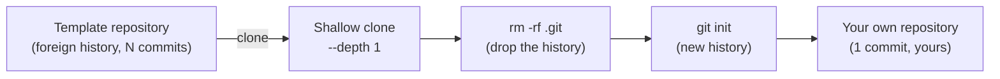

---
# 🧩 Versioning – systém dopĺňa automaticky
fm_version: "1.0.1"

# Dátum buildu – generuje skript
fm_build: "2026-09-21T10:26:31.607237+00:00"

# Poznámka k verzii – voliteľné
fm_version_comment: ""


# 🆔 IDENTITY --------------------------------------------------------

# ID generuje CLI / skript
id: "K000119_EN"

# Unikátne UUID – generuje skript
guid: "0418401b-d3eb-49ec-82b0-a9a735836b01"


# 🧭 CONTEXT ---------------------------------------------------------

# DAO / doména (knife, sdlc, q12, 7ds...) dopĺňa skript
dao: "knife"

# Názov zápisu – dopĺňa používateľ
title: "K000119 – How to create a clean clone of a class repository"

# Krátky popis – dopĺňa používateľ (voliteľné)
description: "How to turn any class/team template repository into your own clean clone without foreign history — one standard procedure instead of everyone solving it (or copying it wrongly) on their own. Applied to starting a repository for the STHDF 2026-2027 course."


# 👥 AUTHORSHIP ------------------------------------------------------

# Hlavný autor – z globálneho configu
author: "Roman Kazicka"

# Zoznam autorov – generuje skript
authors:
  - "Roman Kazicka"


# 🗂 CLASSIFICATION ---------------------------------------------------

# Nadradená kategória – môže doplniť používateľ
category: "KNIFE"

# Typ dokumentu (guide, case, tutorial...) – používateľ (voliteľné)
type: "tutorial"

# Priorita (low/medium/high) – voliteľné
priority: "medium"

# Tagy – odporúča sa 2–6 tagov.
# Typy tagov:
#   - rámce: knife, 7ds, sdlc, q12
#   - účel: tutorial, guide, pattern, case-study
#   - téma: git, backup, ai, communication
#   - úroveň: beginner, intermediate, advanced
tags: ["git", "tutorial", "onboarding", "template", "beginner"]


# 🌍 LOCALIZATION -----------------------------------------------------

# Jazyk dokumentu – doplní skript podľa štruktúry
locale: "en"


# 🕒 LIFECYCLE --------------------------------------------------------

# Dátum vytvorenia – generuje skript
created: "2026-09-21 12:26"

# Dátum poslednej úpravy – dopĺňa človek
modified: "2026-09-21 12:26"

# Stav dokumentu – default "backlog"
status: "published"

# Viditeľnosť – default "public"
privacy: "public"


# ⚖ INTELLECTUAL PROPERTY -------------------------------------------

# Držiteľ práv k obsahu – dopĺňa skript
rights_holder_content: "Roman Kazicka"

# Systémový vlastník práv
rights_holder_system: "CAA / KNIFE / LetItGrow"

# Licencia
license: "CC-BY-NC-SA-4.0"

# Disclaimer
disclaimer: "Use at your own risk. Methods provided as-is; participation is voluntary and context-aware."

# Copyright
copyright: "© 2025 Roman Kazicka"


# 🔗 ORIGIN / PROVENANCE ---------------------------------------------

# Repozitár pôvodu
origin_repo: "knifes_overview-03"

# URL pôvodného repozitára
origin_repo_url: ""

# Commit pôvodu
origin_commit: ""

# Branch pôvodu
origin_branch: "main"

# Systém pôvodu (CAA/KNIFE/STHDF…)
origin_system: "CAA"

# Pôvodný autor
origin_author: "Roman Kazicka"

# Importovaný zdroj
origin_imported_from: ""

# Dátum importu
origin_import_date: ""


# 🧱 RESERVED ---------------------------------------------------------

fm_reserved1: ""
fm_reserved2: ""
---

# How to create a clean clone of a class repository

> **KNIFE** – Knowledge In Friendly Examples
> **Series:** Systemic Thinking in IT & Digital Fabrication
> **Level:** Beginner
> **Tags:** `git` `tutorial` `onboarding` `template` `beginner`

## ⚡ Quick guide (Top)

Open a terminal in the folder **in which** your new project should live
(e.g. `~/School/STHDF/`) — not in a folder that does not exist yet. The
clone creates `<my-folder>` by itself as a subfolder:

```bash
git clone --depth 1 <TEMPLATE-URL> <my-folder>
cd <my-folder>
rm -rf .git
git init
git add -A
git commit -m "Initial commit"
```

Result: `<my-folder>/` is a new, standalone git repository with a single
commit — the full content of the template, none of its history.

**With real values** (the template is real, the folder is a made-up example following the convention from step 2 below):

```bash
git clone --depth 1 https://github.com/06-STH-Projects/2026_sthdf_class_template.git ST-099-Example
cd ST-099-Example
rm -rf .git
git init
git add -A
git commit -m "Initial commit"
```

## 🎯 What it solves (purpose, goal)

When someone tells you "make a clone of this repository", the most
natural reaction is `git clone <url>`. The problem: it transfers not only
the content but the **entire history** of the source repository — every
commit, every message, every author who ever worked on the template.

For a one-off template repository this causes three real problems:

1. **Foreign history in your repository.** `git log` shows somebody
   else's commits, not your work — orientation and `git blame` are
   polluted from the very start.
2. **A hidden link to the original repo.** The clone keeps `origin`
   pointing at the template — it is easy to push (or try to push) to
   somebody else's repository by mistake instead of your own.
3. **Without a standard, everybody solves it differently** — or copies a
   wrong procedure from someone else. That is exactly why this is a
   KNIFE and not just a one-off note: once written down, the procedure
   can be handed on — from teacher to students, and later between
   students.

## 🧩 How it solves it (principle)



Three steps, each with a clear reason:

1. **`git clone --depth 1`** — downloads only the current state of the
   files, not the whole history (faster, less data — although a `.git/`
   folder is still brought along).
2. **`rm -rf .git`** — removes the inherited `.git` directory entirely.
   Both the history and the link to the template's `origin` disappear.
3. **`git init` + `git add -A` + `git commit`** — creates a completely
   new, empty history with a single commit: "this is my start".

## 🧪 How to use it (application)

**Step by step:**

1. **Verify the template URL** given to you by the teacher / team lead.
2. **Choose a folder name following the agreed convention** — in the
   STHDF course e.g. `ST-042-MyName` (individual work) or
   `PRJ-017-ProjectName` (team project). The convention is reused later
   when outputs are published, so stick to it from the start.
3. **Run the three commands from the Quick guide** above.
4. **Create an empty repository on GitHub** (no README, no
   `.gitignore` — you already have them from the clone) and connect it:

   ```bash
   git remote add origin <URL-of-your-new-repository>
   git branch -M main
   git push -u origin main
   ```

5. **Check that `git remote -v` points to YOUR repository**, not to the
   template.

> **There is no "school server".** The repository from step 4 is just an
> ordinary personal GitHub account — there is nothing else to set up or
> register for. If you do not have a GitHub account yet, create one at
> [github.com/join](https://github.com/join) (free).

6. **Later, when your output is finished — you do not have to do
   anything with the class repository itself.** Your repository from
   steps 1–5 is completely independent and stays that way. The teacher
   projects it into the class dashboard (`students/ST0XX/`) — your only
   job is to have your assigned `ST0XX` number (roster) and to **share
   the link to your finished repository** wherever the teacher tells
   you. Transferring it to the class repository is the teacher's
   process, not yours.

**A real-life example:** this exact procedure was used to start the
repository for the new run of the course — `2026_sthdf_class_template` →
clone → `class_sthdf_2026-2027`, with a single "Initial commit" instead
of the inherited history of dozens of earlier template iterations.

## 📜 Detailed article

**Why not a plain `git clone`?** Without `--depth 1` and without
cleaning `.git/` afterwards you inherit everything — including things
that were never meant for public circulation in the template (old notes,
work-in-progress commits, names of previous authors). For a one-off
start of a new project this has no value, only noise and risk.

**Why not `degit` or another specialised tool?** Tools exist (e.g.
`npx degit`) that do exactly this in one command. Here, however, the
procedure deliberately uses **plain git only** — it works anywhere git
is installed, with no dependency on Node.js/npm or any other runtime.
For a group in which not everybody has the same development
environment, it is the more reliable common denominator.

**Why `rm -rf .git` and not e.g. `git checkout --orphan`?** `--orphan`
creates a new branch without parents, but the original commits remain
reachable in the repository (until `git gc` removes them) and `origin`
stays set to the template. `rm -rf .git` + `git init` is more
unambiguous: after this step there is no trace of the original
repository in the folder.

## 💡 Tips and notes

- **Folder already exists?** `git clone` refuses to clone into a
  non-empty folder — check the name beforehand, or clone into a
  temporary name and rename it.
- **Forgot `rm -rf .git`?** You can tell because `git log` shows foreign
  commits. Check right after the clone (`git log --oneline` should show
  only the template's history until you run `git init`).
- **`git push` fails with "Permission denied"?** Check `git remote -v`
  — if it still points to the template instead of your repository, the
  `.git` folder was not removed properly.
- **Windows:** the procedure works the same in Git Bash; in PowerShell
  replace `rm -rf .git` with `Remove-Item -Recurse -Force .git`.

## ✅ Value / Summary

Three commands instead of repeated live explanations — and above all
**one written-down, repeatable procedure** instead of every student (or
every new year) discovering it from scratch, or taking a wrong version
from a classmate. It works for any template repository, not just STHDF
— it is a general onboarding pattern for a new project.

## Sources

Created directly from preparing `2026_sthdf_class_template` for the
STHDF 2026-2027 run (repository `06-STH-Projects/2026_sthdf_class_template`,
script `tools/clone-student-template.sh`) — written down as a standalone
KNIFE so that the procedure is portable beyond this one course.

<!-- body:start -->

<!-- nav:knifes -->
> [⬅ KNIFES – Overview](../knifes_overview/KNIFE_Overview_Blog.md) • [List](../knifes_overview/KNIFE_Overview_List.md) • [Details](../knifes_overview/KNIFE_Overview_Details.md)
---
