# GitHub Education Faculty Benefits – Usage Scenario

<!-- fm-visible: start -->
> **GUID:** `280b3b24-c7e8-4aa9-a870-838c461f8b10`
> **Status:** `inprogress` · **Author:** Roman Kazička · **License:** CC-BY-NC-SA-4.0
<!-- fm-visible: end -->

Tento návod popisuje, čo robiť po schválení GitHub Education Faculty Benefits.

## ✅ Status
- Schválené: **August 26, 2025**
- Platnosť do: **August 26, 2027**
- Typ: **Faculty**

---

## 1. Aktivácia Team plánu pre organizácie
1. Prejdi do svojej organizácie (`SystemThinking`, `STHDF-2025-2026`, ...).
2. V menu klikni na **Settings → Billing**.
3. Nájdeš tam možnosť **Upgrade to Team for free via GitHub Education**.
   https://education.github.com/globalcampus/teacher

4. Aktivuj – odteraz má organizácia **GitHub Team plan zadarmo**.

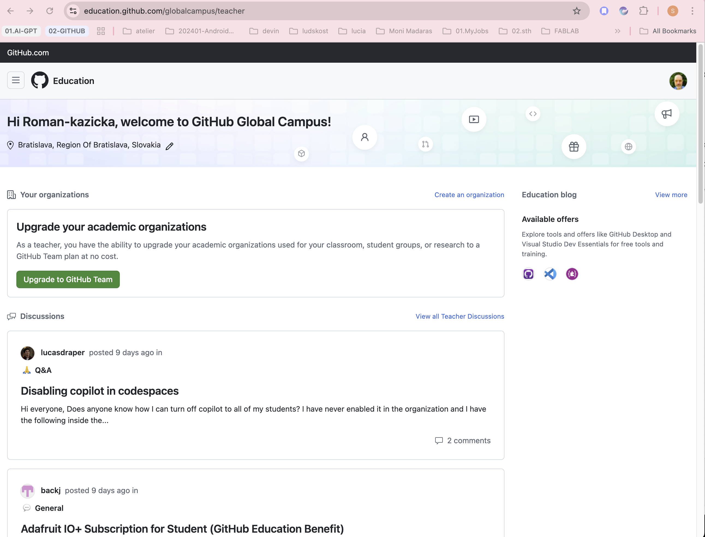

### Kontrola aktivácie
- Na screenshote je vidno 0€/mesiac, inak by tam bolo 4€/mesiac

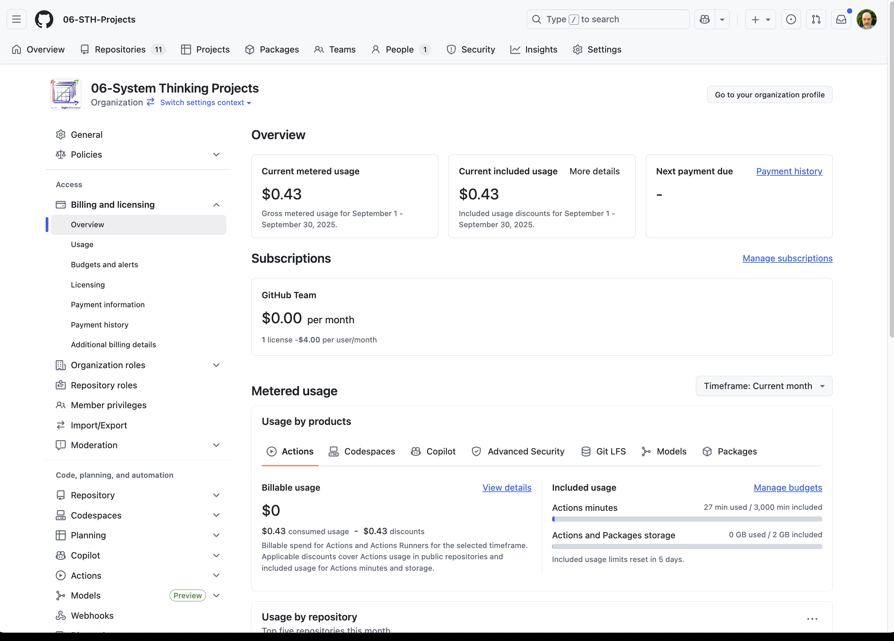
- Využitie podľa repozitárov
 
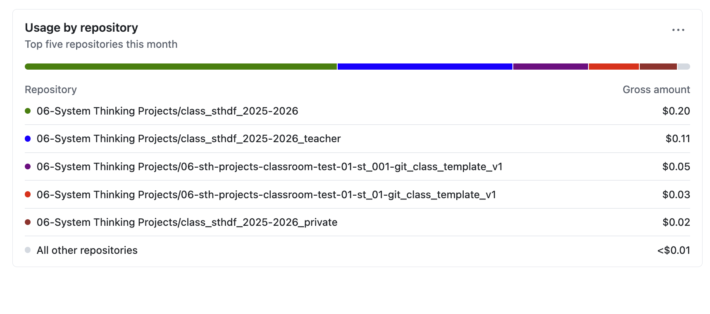

Vidno, že poplatky za používanie nejaké sa priebežne počítajú, ale mne sa nebudú účtovať, lebo benefity.
---

## 2. Aktivácia Copilot Pro kupónu

1. Vráť sa do [Education Benefits](https://github.com/settings/education/benefits)

2. Klikni na odkaz „To redeem your Copilot Pro coupon, please sign up via this link“.

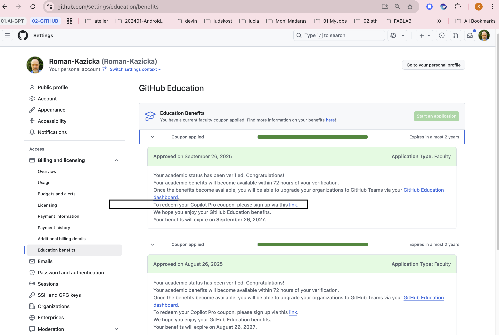
   
3. Upgrade to Copilot Team.

4. Copilot - step 01

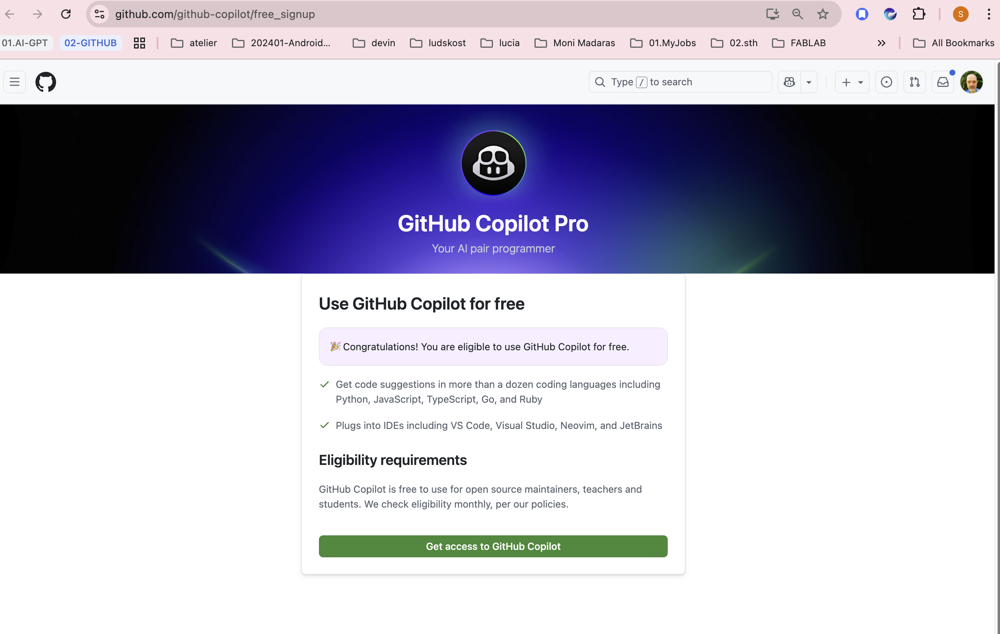

5. Copilot - step 02
   
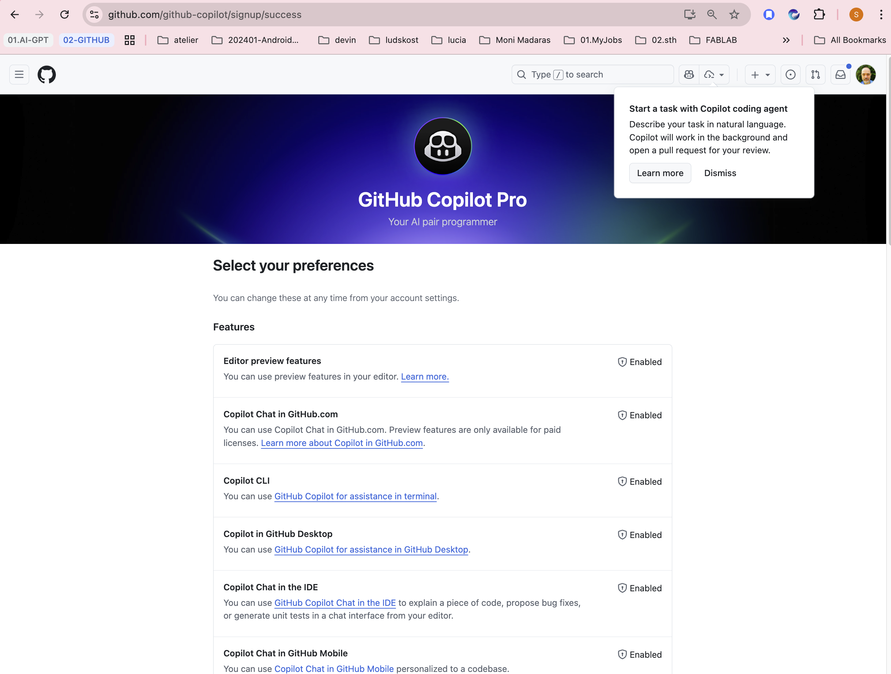 

6. Copilot - Step 03

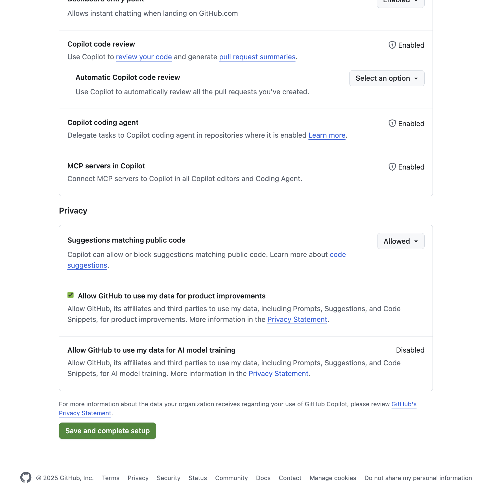

7. Copilot - Step 04

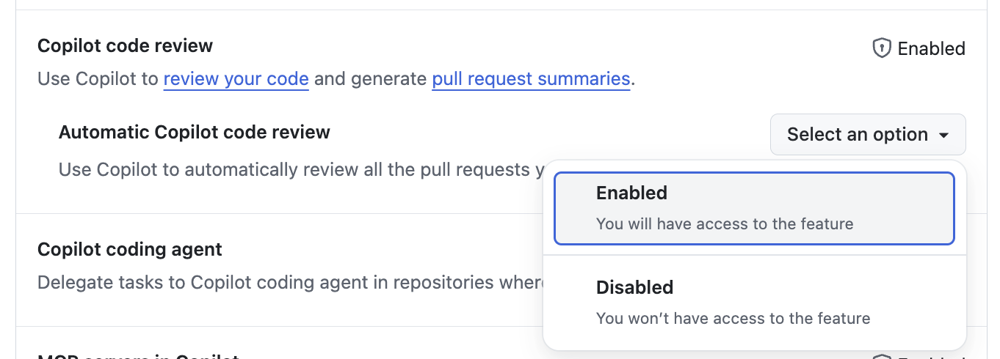

8. Copilot - Step 05
    
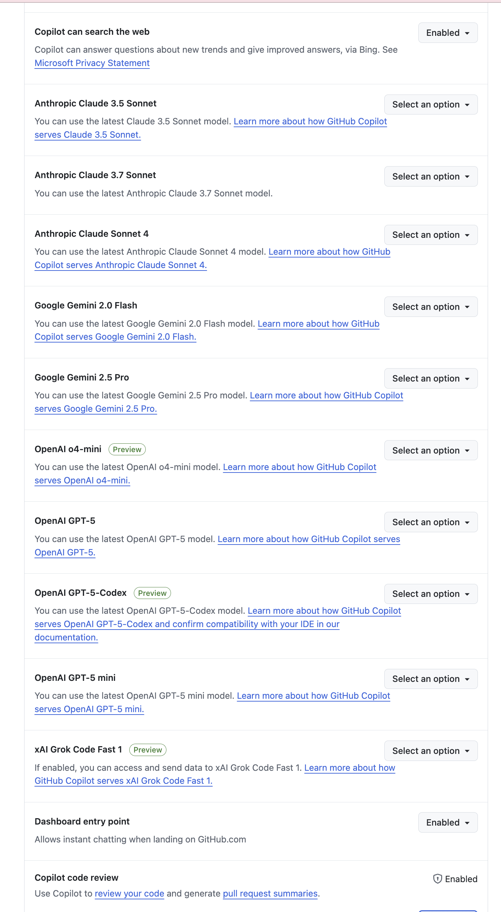

9. Copilot - Step 06

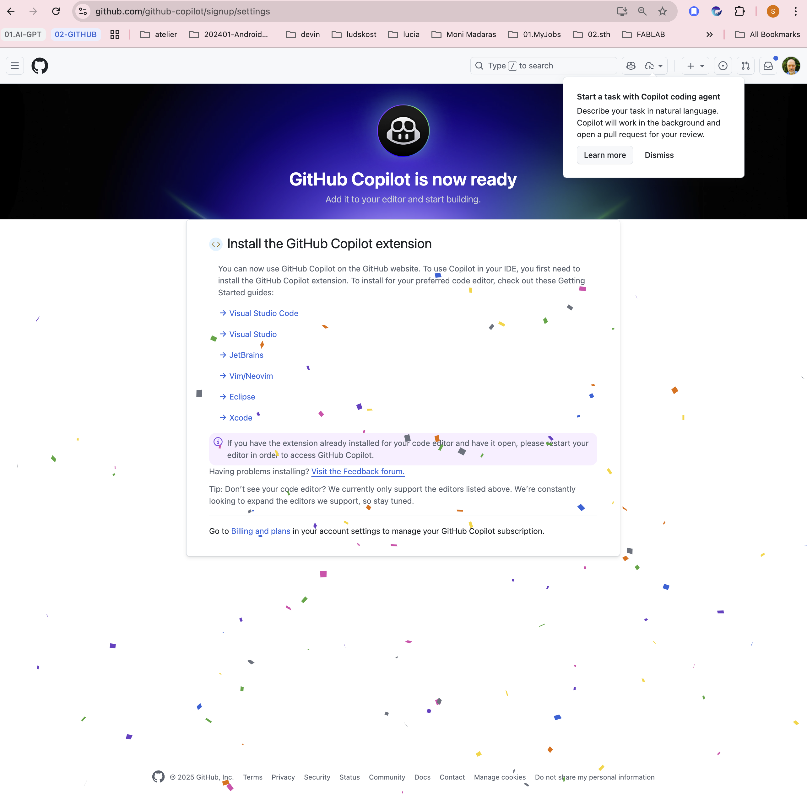

10. Copilot - Step 07

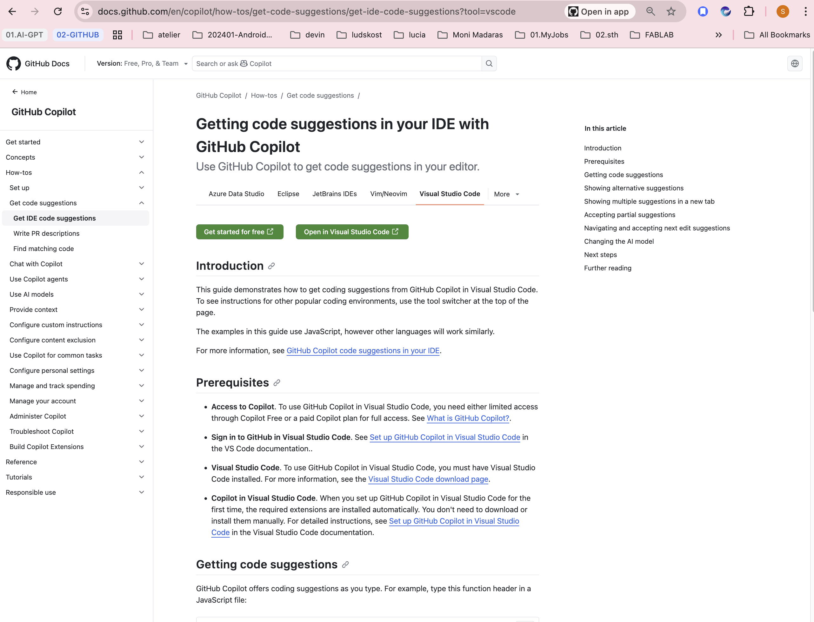

## Získané vlastnosti
https://github.com/settings/copilot/features

---

## 3. Kontrola statusu
- Prejdi na [https://github.com/settings/education/benefits](https://github.com/settings/education/benefits).
- Mal by svietiť zelený status **Approved**.

---

## 🎉 Výhody po aktivácii
- GitHub Team plan pre organizácie zdarma (private repo, Actions minutes, Pages builds)
- Copilot Pro pre teba a možnosť kupónov pre študentov
- Partnerské benefity (JetBrains, Canva EDU, DigitalOcean credits ...)

---

## 📌 Ďaľšie informácie

https://docs.github.com/en/copilot

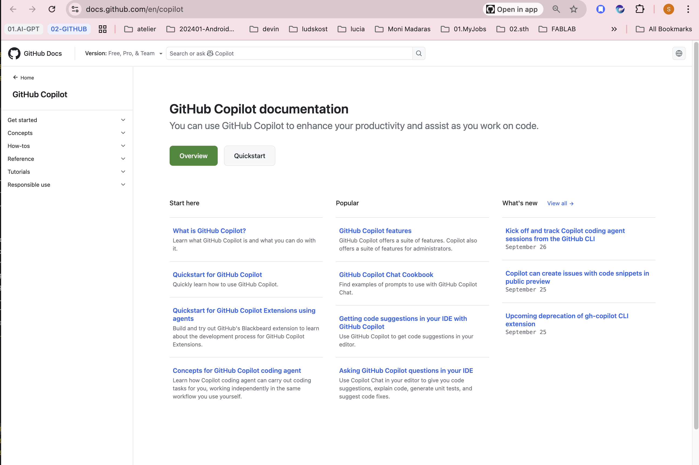
