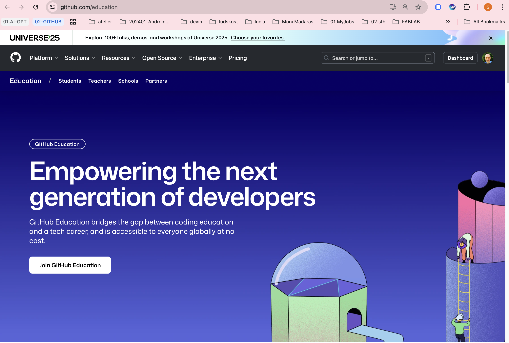
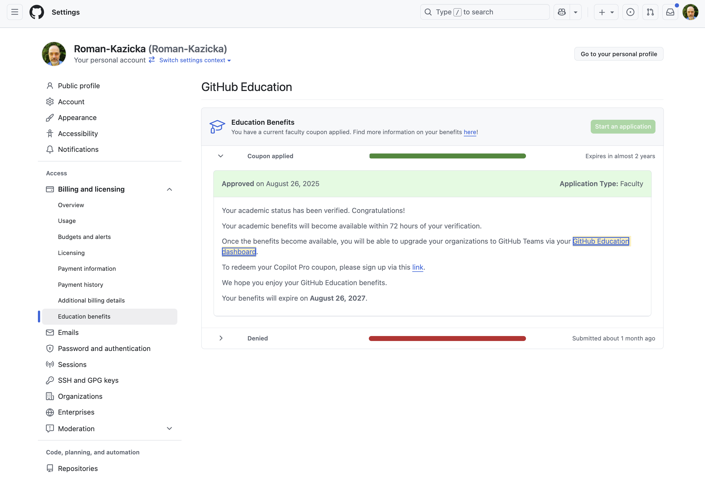
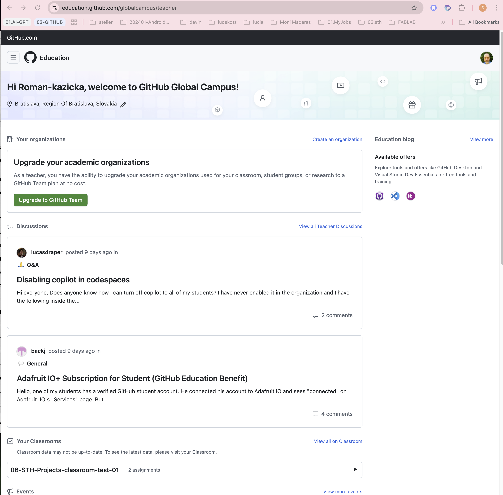
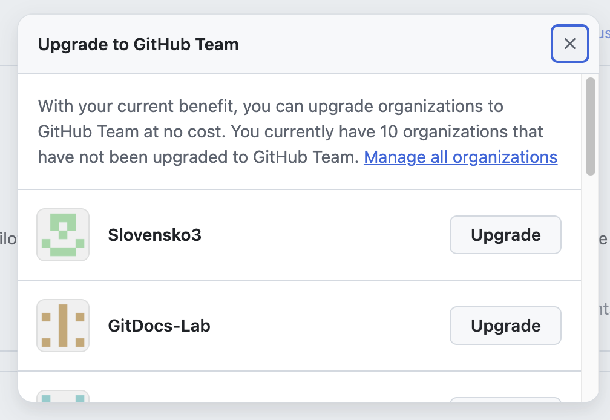

# Aktivácia GitHub Education Faculty Benefits

<!-- fm-visible: start -->
> **GUID:** `86b73fab-96ed-432b-aeb6-e262b378aa27`
> **Status:** `inprogress` · **Author:** Roman Kazička · **License:** CC-BY-NC-SA-4.0
<!-- fm-visible: end -->

## 1. Otvor portál GitHub Education
👉 [https://education.github.com/benefits](https://education.github.com/benefits)

### Linka na GItBenefit Dashboard
Klikni **Get benefits**.

---

## 2. Vyber svoj status
- Zvoľ **Teacher**.

---

## 3. Vyplň žiadosť
- Prihlás sa svojím GitHub účtom.
- Zadaj univerzitný e-mail (`@stuba.sk`).
- Prilož dôkaz (link na web univerzity, scan preukazu, syllabus).

---

## 4. Overenie identity
- GitHub tím manuálne overí údaje (2–14 dní).
- Dostaneš e-mail **“Your GitHub Education benefits are active”**.

---

## 5. Aktivácia v organizácii
-  Klikni na **Upgrade to Team for free (via GitHub Education)**.

---

## 6. Kontrola
- V **Settings → Billing & plans → GitHub Education** vidíš svoj status.
- V GitHub Classroom máš „Faculty verified“ badge.
- https://education.github.com/globalcampus/teacher
  

Na tejto stránke sa dajú pridávť jednotlivé organizácie a im podriadené repozitáre do GitHubTeam.

---

## 🎉 Hotovo!
Teraz máš:
- GitHub Team plan pre organizácie zdarma
- Copilot Pro kupóny
- vyššie limity Actions & Pages
- ďalšie partnerské benefity
