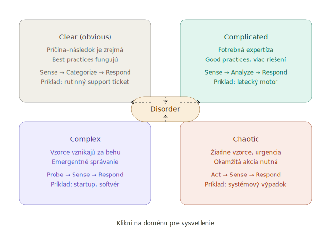

---
# 🧩 Versioning – systém dopĺňa automaticky
fm_version: "1.0.1"

# Dátum buildu – generuje skript
fm_build: "2026-04-23T21:03:29.254689+00:00"

# Poznámka k verzii – voliteľné
fm_version_comment: ""


# 🆔 IDENTITY --------------------------------------------------------

# ID generuje CLI / skript
id: "K000101"

# Unikátne UUID – generuje skript
guid: "ba6374cd-3f7d-4451-95e3-2312ef23a25a"


# 🧭 CONTEXT ---------------------------------------------------------

# DAO / doména (knife, sdlc, q12, 7ds...) dopĺňa skript
dao: "knife"

# Názov zápisu – dopĺňa používateľ
title: "K000101 – CYNEFIN Framework"

# Krátky popis – dopĺňa používateľ (voliteľné)
description: "{{DESCRIPTION}}"


# 👥 AUTHORSHIP ------------------------------------------------------

# Hlavný autor – z globálneho configu
author: "Roman Kazicka"

# Zoznam autorov – generuje skript
authors:
  - "Roman Kazicka"


# 🗂 CLASSIFICATION ---------------------------------------------------

# Nadradená kategória – môže doplniť používateľ
category: ""

# Typ dokumentu (guide, case, tutorial...) – používateľ (voliteľné)
type: ""

# Priorita (low/medium/high) – voliteľné
priority: ""

# Tagy – odporúča sa 2–6 tagov.
# Typy tagov:
#   - rámce: knife, 7ds, sdlc, q12
#   - účel: tutorial, guide, pattern, case-study
#   - téma: git, backup, ai, communication
#   - úroveň: beginner, intermediate, advanced
tags: []


# 🌍 LOCALIZATION -----------------------------------------------------

# Jazyk dokumentu – doplní skript podľa štruktúry
locale: "sk"


# 🕒 LIFECYCLE --------------------------------------------------------

# Dátum vytvorenia – generuje skript
created: "2026-04-23 23:03"

# Dátum poslednej úpravy – dopĺňa človek
modified: "2026-04-23 23:03"

# Stav dokumentu – default "backlog"
status: "backlog"

# Viditeľnosť – default "public"
privacy: "public"


# ⚖ INTELLECTUAL PROPERTY -------------------------------------------

# Držiteľ práv k obsahu – dopĺňa skript
rights_holder_content: "Roman Kazicka"

# Systémový vlastník práv
rights_holder_system: "CAA / KNIFE / LetItGrow"

# Licencia
license: "CC-BY-NC-SA-4.0"

# Disclaimer
disclaimer: "Use at your own risk. Methods provided as-is; participation is voluntary and context-aware."

# Copyright
copyright: "© 2025 Roman Kazicka"


# 🔗 ORIGIN / PROVENANCE ---------------------------------------------

# Repozitár pôvodu
origin_repo: ""

# URL pôvodného repozitára
origin_repo_url: ""

# Commit pôvodu
origin_commit: ""

# Branch pôvodu
origin_branch: ""

# Systém pôvodu (CAA/KNIFE/STHDF…)
origin_system: "CAA"

# Pôvodný autor
origin_author: "Roman Kazicka"

# Importovaný zdroj
origin_imported_from: ""

# Dátum importu
origin_import_date: ""


# 🧱 RESERVED ---------------------------------------------------------

fm_reserved1: ""
fm_reserved2: ""
---

# Názov KNIFE (zmeň ma)

## 🎯 Čo rieši (účel, cieľ)

## 🧩 Ako to rieši (princíp)

## 🧪 Ako to použiť (aplikácia)

---

## ⚡ Rýchly návod (Top)

## 📜 Detailný článok

## 💡 Tipy a poznámky

## ✅ Hodnota / Zhrnutie

<!-- body:start -->

<!-- nav:knifes -->
> [⬅ KNIFES – Prehľad](../knifes_overview/KNIFE_Overview_Blog.md) • [Zoznam](../knifes_overview/KNIFE_Overview_List.md) • [Detaily](../knifes_overview/KNIFE_Overview_Details.md)
---

<!-- body:start -->

<!-- nav:knifes -->
> [⬅ KNIFES – Prehľad](../knifes_overview/KNIFE_Overview_Blog.md) • [Zoznam](../knifes_overview/KNIFE_Overview_List.md) • [Detaily](../knifes_overview/KNIFE_Overview_Details.md)

---

# Cynefin – Sense-making framework pre rozhodovanie v komplexných doménach

<!-- fm-visible: start -->
> **GUID:** `d218a4fd-dca8-422c-b42e-387d6992bf1b`
> **Status:** `draft` · **Author:** Roman Kazicka · **License:** CC-BY-NC-SA-4.0
<!-- fm-visible: end -->

---

## 🎯 Čo rieši (účel, cieľ)

Cynefin pomáha správne **zaradiť situáciu** podľa toho, ako dobre rozumieme vzťahu príčina–následok.
Bez tohto zaradenia hrozí, že aplikujeme nesprávny postup – napr. plánujeme waterfall projekt
v doméne, kde vzorce vznikajú až za behu.

**Kľúčová otázka, ktorú Cynefin kladie:**
> *V akej doméne sa nachádzam – a aký postup z toho vyplýva?*

---

## 🧩 Ako to rieši (princíp)

<figure></figure><br/>



Cynefin definuje päť domén podľa povahy príčinno-následkových vzťahov [1]:

| Doména | Charakter | Postup |
|---|---|---|
| **Clear** (Obvious) | Príčina–následok je zrejmá | Sense → Categorize → Respond |
| **Complicated** | Príčina existuje, vyžaduje expertízu | Sense → Analyze → Respond |
| **Complex** | Vzorce sa objavujú až retrospektívne | **Probe → Sense → Respond** |
| **Chaotic** | Žiadne vzorce, urgentná akcia | Act → Sense → Respond |
| **Disorder** | Nevieš, v ktorej doméne si | Rozlíšenie je prvý krok |

**Kľúčový insight:** Väčšina softvérových a znalostných projektov je **Complex**, nie Complicated.
Complicated by znamenalo, že existuje odborník, ktorý pozná riešenie vopred.
Complex znamená, že riešenie sa musí objaviť skrz interakciu so systémom [2].

---

### Domény podrobnejšie

#### Clear (Obvious)

**Clear** je doména kde vzťah príčina–následok je **zrejmý každému** – nevyžaduje analýzu ani expertízu.

Postup: Sense → Categorize → Respond

1. **Sense** – vnímaj fakty bez interpretácie
2. **Categorize** – zariaď do known kategórie, rozpoznaj vzor
3. **Respond** – aplikuj best practice, žiadna improvizácia

Príklady: rutinný support ticket, pravidelný backup, onboarding podľa checklistu.

Typická chyba: tím začne analyzovať kde to nie je potrebné. Ak situácia vyžaduje analýzu – pravdepodobne si v Complicated, nie Clear.

> **⚠ Cliff edge:** Z Clear môžeš spadnúť **priamo do Chaotic** – nie postupne, ale skokom.
> Complacency po dlhom období bez incidentu je hlavné riziko.
> Liek: periodicky overuj či situácia stále patrí do Clear.

---

#### Complicated

**Complicated** je doména kde vzťah príčina–následok **existuje a je poznateľný** – ale vyžaduje expertízu alebo analýzu.

Postup: Sense → Analyze → Respond

1. **Sense** – zozbieraj fakty
2. **Analyze** – konzultuj experta, meria, diagnostikuj, porovnaj možnosti
3. **Respond** – aplikuj good practice vybranú pre tento kontext

| | Best practice (Clear) | Good practice (Complicated) |
|---|---|---|
| Počet riešení | Jedno správne | Viacero dobrých |
| Kontext | Nezávisí od kontextu | Závisí od kontextu |
| Kto rozhoduje | Ktokoľvek podľa SOP | Expert s úsudkom |

Príklady: letecký motor, daňová optimalizácia, architektúra systému, chirurgický zákrok.

Riziká: expert trap, analysis paralysis, zámena s Complex.

> **Praktický test:** *„Ak zavolám najlepšieho experta – vie nám povedať riešenie vopred?"*
> Áno → Complicated. Nie, musíme to vyskúšať → Complex.

---

#### Complex

**Complex** je doména kde vzťah príčina–následok **nie je poznateľný vopred** – objavuje sa až retrospektívne z interakcie so systémom.

Postup: Probe → Sense → Respond

| Krok | Čo robíš | Príklad |
|---|---|---|
| **Probe** | Bezpečný experiment | MVP, spike, prototyp, A/B test |
| **Sense** | Pozoruj čo sa objavilo | Retrospektíva, GAP review, feedback |
| **Respond** | Reaguj na základe učenia | Refaktoring, pivot, redesign |

> Plán v Complex doméne nie je mapa reality. Je to hypotéza ktorú treba otestovať.

Agile je navrhnutý *pre* Complex doménu: Sprint = Probe, Retrospektíva = Sense, Refaktoring = Respond.
Bez Respond je Agile len rýchly waterfall s iným menom.

---

#### Chaotic

**Chaotic** je doména kde **žiadny vzťah príčina–následok neexistuje** – systém je rozpadnutý, každá sekunda bez akcie je horšia ako neideálna akcia.

Postup: Act → Sense → Respond

| Krok | Čo robíš | Príklad |
|---|---|---|
| **Act** | Zastav krvácanie okamžite | Rollback, shutdown, izolácia |
| **Sense** | Čo akcia spôsobila? | Čo sa stabilizovalo, čo stále horí |
| **Respond** | Presun do inej domény | Incident review, stabilizačný plán |

V Chaotic jeden človek rozhoduje – konsenzus je luxus stabilných domén.
Cieľ nie je vyriešiť problém – je to dostať systém z Chaotic do Complex alebo Complicated.

> **⚠ Najnebezpečnejší vzorec:**
> Kríza → Act → stabilizácia → úľava → zabudnutie → ďalšia kríza.
> Tímy ktoré nevykonajú Respond po kríze garantujú ďalšiu – väčšinou horšiu.

---

#### Disorder

**Disorder** je stav keď **nevieš v ktorej doméne si**. Rozlíšenie je prvý a jediný krok.

Väčšina konfliktov v tímoch vzniká keď každý vníma situáciu cez inú doménu – jeden vidí Complicated, druhý Complex.

---

## 🧪 Ako to použiť (aplikácia)

### Postup zaradenia domény

1. Opíš situáciu jednou vetou.
2. Polož otázku: *„Viem príčinu a následok vopred?"*
   - Áno, je triviálna → **Clear**
   - Áno, ale treba expertízu → **Complicated**
   - Nie, ukáže sa až neskôr → **Complex**
   - Vôbec nie, systém je rozpadnutý → **Chaotic**
3. Zvol postup zodpovedajúci doméne.

### Aplikácia v SDLC / Agile

```
Complex doména:
  Probe    →  MVP, spike, prototyp
  Sense    →  retrospektíva, GAP review, analýza výsledkov
  Respond  →  refaktoring, redesign, úprava plánu
```

Väčšina organizácií vykonáva Probe a Sense. **Respond (refaktor) vynechávajú** pod
biznis tlakom – a tým sa systém postupne presúva smerom ku Chaotic.

---

## ⚡ Rýchly návod (Top)

1. **Identifikuj doménu** – Clear / Complicated / Complex / Chaotic
2. **Zvol zodpovedajúci postup** – nie každá situácia chce analýzu ani nie každá chce experiment
3. **Pre Complex domény:** Probe → Sense → Respond (iteratívne, nie jednorazovo)
4. **Technický dlh = acumulovaný Respond, ktorý nebol vykonaný**
5. **Refaktoring nie je trest – je to dôkaz, že Probe fungoval**

---

## 📜 Detailný článok

<figure></figure><br/>


### Pôvod a kontext

Cynefin vytvoril Dave Snowden (IBM Institute for Knowledge Management) okolo roku 1999,
pôvodne pre knowledge management v organizáciách [1].
Slovo *cynefin* pochádza z waleštiny a znamená približne „habitat" alebo „miesto kde patríš" –
miesto, ktoré formuje to, kto si, aj keď si ho plne neuvedomuješ [3].

Neskôr ho Snowden rozvinul cez svoju firmu Cognitive Edge a publikoval v Harvard Business Review (2007) [2].

### Prečo je Complex iná ako Complicated

Toto rozlíšenie je najdôležitejší praktický výstup Cynefinu:

**Complicated:**
- Letecký motor je komplikovaný – ale existujú odborníci, ktorí mu rozumejú.
- Môžeš najať experta, ktorý vypracuje plán vopred.
- Best practice fungujú.

**Complex:**
- Ekosystém, startup, softvérový produkt v novej doméne, BaZi implementácia.
- Žiadny expert nevie vopred, ako sa správanie systému prejaví v konkrétnom kontexte.
- Good practice nahrádzajú best practice – čo funguje inde, nemusí fungovať tu.
- Vzorce sa objavujú až z interakcie [2].

### Probe → Sense → Respond v softvérovom projekte

**Probe – experimentuj bezpečne:**

```
MVP          →  minimálna verzia pre reálnych používateľov
Spike        →  časovo ohraničený technický experiment (1-2 dni)
Prototyp     →  throwaway kód pre overenie konceptu
Feature flag →  nová funkcionalita pre 5% používateľov
A/B test     →  dve verzie, meriame ktorá funguje lepšie
```

**Sense – pozoruj čo sa objavilo:**

```
Retrospektíva  →  čo fungovalo, čo nie, prečo
GAP review     →  rozdiel medzi plánom a realitou
User feedback  →  čo používatelia skutočne robia
Monitoring     →  logy, metriky, error rates
```

**Respond – integruj čo si sa naučil:**

```
Refaktoring    →  kód ktorý vznikol rýchlo sa prerobí správne
Pivot          →  zmeníme smer na základe user feedbacku
Redesign       →  architektúra ktorá nevyhovuje sa prepíše
Dokumentácia   →  znalosti sa zaznamenajú (KNIFE item)
```

Respond musí byť vykonaný *pred* ďalším Probe. Inak každý sprint pridáva vrstvu na neošetrený základ.

### Cynefin a technický dlh

Technický dlh nie je len „zlý kód". Cez Cynefin je to **akumulovaná odpoveď (Respond),
ktorá nebola vykonaná**:

```
Probe  ✓   MVP bol spustený
Sense  ✓   problémy sú identifikované (GAP_REVIEW, DryRun výstupy)
Respond ✗  biznis tlak, ideme ďalej bez refaktoru
```

Každý vynechaný Respond zvyšuje entropiu systému. Systém sa nepresúva naraz do Chaotic –
eroduje postupne, každým sprintom bez refaktoringu.

Argument pre biznis: *„Technický dlh je úrok. Čím dlhšie ho nesplácame, tým drahšie
je každé ďalšie rozšírenie."*

### Cynefin v praxi – KnowMyself / BaZi

BaZi je **Complex doména**:

- Ani po prečítaní všetkých kníh nevieš, ako sa nuansy domény prejavia v implementácii.
- GAP v názvoch NR sa objavil až pri reálnej práci, nie pri analýze.
- Naming convention sa vyvinula iteratívne, nie bola definovaná vopred kompletne.

Celý DAY refaktoring cyklus je ukážkou `Probe → Sense → Respond` v praxi:

```
Probe    =  implementácia prvého piliera (DAY)
Sense    =  GAP_REVIEW odhalil nekonzistencie
Respond  =  systematický refaktoring s DryRun → Apply → Verify auditnou stopou
```

---

## 💡 Tipy a poznámky

- **Disorder je nebezpečná doména** – väčšina konfliktov v tímoch vzniká, keď každý
  vníma situáciu cez inú doménu (jeden vidí Complicated, druhý Complex).
- **Cynefin nie je statický** – situácia sa môže presúvať medzi doménami.
  Nezvládnutý chaos sa môže stabilizovať do Complex, alebo Complex môže erodovať do Chaotic.
- **Pre agilné tímy:** Retrospektíva = Sense. Refaktoring sprint = Respond.
  Bez Respond je Agile len rýchly waterfall s iným menom.
- **Cliff edge efekt** – Cynefin upozorňuje, že z Clear domény môžeš spadnúť priamo do Chaotic
  (nie cez Complicated/Complex) ak systém začneš preceňovať. Complacency je riziko.

---

## ✅ Hodnota / Zhrnutie

Cynefin dáva meno niečomu, čo intuitívne cítiš pri práci s komplexnými doménami:
**nie všetko sa dá naplánovať vopred – a to nie je chyba, to je vlastnosť domény.**

Kľúčové výstupy:

- Rozlíšenie Complex vs. Complicated je najdôležitejší praktický nástroj frameworku.
- `Probe → Sense → Respond` je jediný epistemicky poctivý postup pre komplexné domény.
- Refaktoring je **Respond** – nie korekcia chyby, ale súčasť učiaceho sa cyklu.
- Technický dlh = acumulovaný nevykonaný Respond.
- Vynechanie Respond pod biznis tlakom je systematická príčina erózie systémov.

---

## Sources

[1] https://cynefin.io/wiki/Cynefin

[2] https://hbr.org/2007/11/a-leaders-framework-for-decision-making

[3] https://thecynefin.co/about-us/about-cynefin-framework/


---

<!-- nav:knifes -->
> [⬅ KNIFES – Prehľad](../knifes_overview/KNIFE_Overview_Blog.md) • [Zoznam](../knifes_overview/KNIFE_Overview_List.md) • [Detaily](../knifes_overview/KNIFE_Overview_Details.md)