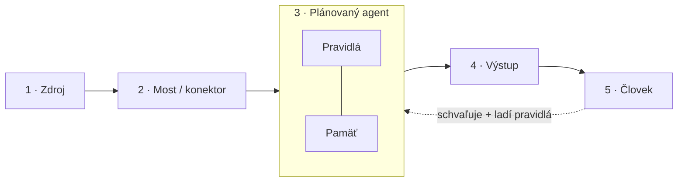
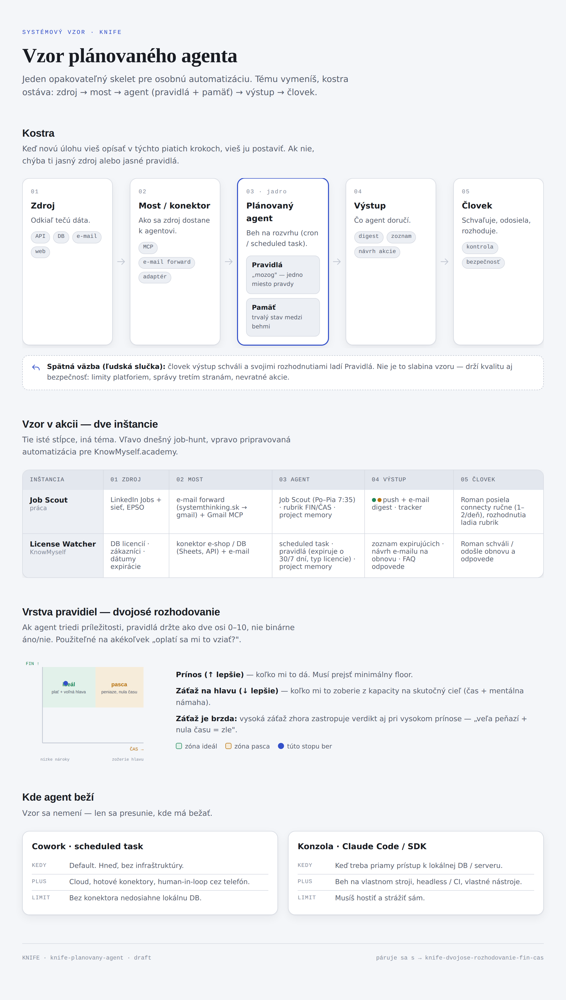
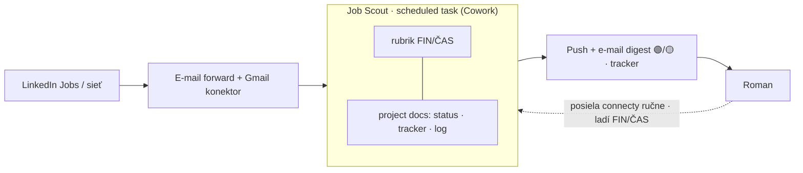

# K000111 – Vzor plánovaného agenta

> **KNIFE** – Knowledge In Friendly Examples
> **Séria:** Systemic Thinking in IT & Digital Fabrication
> **Úroveň:** Stredná – pokročilá
> **Tagy:** `automatizácia` `agent` `cowork` `claude` `pattern` `rozhodovanie`

## 🎯 Čo rieši (účel, cieľ)

Ako postaviť akúkoľvek opakovanú osobnú automatizáciu typu „pravidelne pozri X, prefiltruj podľa pravidiel, priprav mi akciu na schválenie" — monitoring, triage, pripomienky, rešerše, prvé odpovede — bez toho, aby si pre každú novú tému vymýšľal architektúru odznova.

## 🧩 Ako to rieši (princíp)

Jeden opakovateľný skelet s piatimi krokmi. Tému vymeníš, kostra ostáva:

*(interaktívny zdroj diagramu: `img/vzor-agenta.html`, tmavý variant: `img/vzor-agenta-dark.png`)*

1. **Zdroj** — odkiaľ tečú dáta (API, DB, e-mail, web).
2. **Most / konektor** — ako sa zdroj dostane k agentovi (MCP konektor, e-mail forward, DB adaptér).
3. **Plánovaný agent** — beh na rozvrhu (cron / scheduled task), ktorý pri každom behu **číta Pravidlá** a **číta/píše Pamäť**.
   - *Pravidlá* = „mozog": jedno miesto pravdy, kde meníš logiku (skóre, prahy, no-go zoznam).
   - *Pamäť* = trvalý stav medzi behmi (docs / DB): tracker, log, status.
4. **Výstup** — čo agent doručí (push/e-mail digest, zoznam, návrh akcie).
5. **Ľudská slučka** — človek výstup **schváli/odošle** a rozhodnutiami **spätne ladí Pravidlá**. Nie je to chyba vzoru; drží kvalitu aj bezpečnosť (limity platforiem, správy tretím stranám).

Keď novú úlohu vieš opísať v týchto piatich krokoch, vieš ju postaviť; ak nie, chýba ti jasný zdroj alebo jasné pravidlá.

### Rules layer — dvojosé rozhodovanie (FIN/ČAS)

Ak agent triedi príležitosti, oplatí sa mať pravidlá ako **dve osi 0–10**, nie binárne áno/nie:

- **PRÍNOS (↑ lepšie)** — koľko mi to dá (napr. financie). Musí prejsť minimálny floor.
- **ZÁŤAŽ NA HLAVU (↓ lepšie)** — koľko mi to zoberie z kapacity na to, čo je naozaj cieľ (čas + mentálna námaha).
- **Záťaž je brzda:** vysoká záťaž zhora zastropuje verdikt aj pri vysokom prínose („veľa peňazí + nula času = zle").

Pôvod: job-filter (FIN/ČAS), ale použiteľné na akékoľvek rozhodnutie „oplatí sa mi to vziať?".

## 🧪 Ako to použiť (aplikácia)

Over si na dvoch nezávislých inštanciách rovnakého vzoru:

| Krok | Job-hunt (Job Scout) | KnowMyself.academy (License Watcher) |
|------|------------------------|----------------------------------------|
| Zdroj | LinkedIn Jobs + sieť, EPSO | databáza licencií · zákazníci · dátumy expirácie |
| Most | e-mail forward (systemthinking.sk → gmail) + Gmail MCP konektor | konektor na e-shop / DB (Sheets, API) + e-mail |
| Agent | Job Scout (Po–Pia 7:35) + rubrik FIN/ČAS + project memory; Claude-in-Chrome na hľadanie kontaktov | „License Watcher" scheduled task + pravidlá (expiruje o 30/7 dní, typ licencie) + project memory |
| Výstup | ranný push/e-mail digest, riadky v trackeri | zoznam expirujúcich · návrh e-mailu na obnovu · FAQ odpovede |
| Človek | Roman posiela connecty ručne (1–2/deň), rozhodnutia ladia rubrik | Roman schváli / odošle obnovu a odpovede |

## ⚡ Rýchly návod (Top)

1. Definuj **Zdroj** a **Most** — bez jasného konektora vzor nefunguje.
2. Napíš **Pravidlá** ako jeden dokument (rubrik), nie roztrúsenú logiku v kóde.
3. Nastav **Pamäť** ako project docs/DB (status, tracker, log) — nie len stav v hlave agenta.
4. Definuj **Výstup** ako niečo, čo sa dá jedným pohľadom schváliť.
5. Ponechaj **človeka v slučke** — schvaľovanie a ladenie pravidiel je súčasť vzoru, nie obchádzka.

## 📜 Detailný článok

### Deployment — kde agent beží

| | Cowork scheduled task | Konzola — Claude Code / SDK |
|--|----------------------|------------------------------|
| Kedy | default, hneď, bez infra | keď treba priamy prístup k lokálnej DB/serveru |
| Plusy | cloud, hotové konektory, human-in-loop cez telefón | beh na vlastnom stroji, headless/CI, vlastné nástroje |
| Limit | bez konektora nedosiahne lokálnu DB | musíš hostiť a strážiť sám |

**Pravidlo:** začni na Cowork vzore; na konzolu/SDK prejdi, až keď agent potrebuje priamy prístup k databáze alebo vlastný beh na serveri. Vzor sa nemení, len sa presunie, kde beží.

### Kedy siahnuť po tomto vzore

Akákoľvek opakovaná úloha typu „pravidelne pozri X, prefiltruj podľa pravidiel, priprav mi akciu na schválenie": monitoring, triage, pripomienky, rešerše, prvé odpovede.

## 💡 Tipy a poznámky

- Mermaid diagramy vyššie sú editovateľný zdroj (verzovateľný text). Tento KNIFE viewer mermaid natívne nerenderuje — preto je vedľa nich aj statický PNG export (`img/`) a samostatný interaktívny HTML zdroj (`img/vzor-agenta.html`) na ďalší SVG/PNG re-export.
- Ak sa vzor použije na triedenie príležitostí, rules layer FIN/ČAS je dobrý default; pre iné typy agentov (napr. čistý monitoring bez rozhodovania) sa táto sekcia vynecháva.

## ✅ Hodnota / Zhrnutie

Jeden skelet, dve nezávisle overené inštancie (Job Scout, License Watcher), jasný rules layer pre rozhodovacie agenty. Namiesto architektúry od nuly pre každú novú automatizáciu stačí dosadiť tému do piatich krokov.

<!-- body:start -->

<!-- nav:knifes -->
> [⬅ KNIFES – Prehľad](../knifes_overview/KNIFE_Overview_Blog.md) • [Zoznam](../knifes_overview/KNIFE_Overview_List.md) • [Detaily](../knifes_overview/KNIFE_Overview_Details.md)
---
