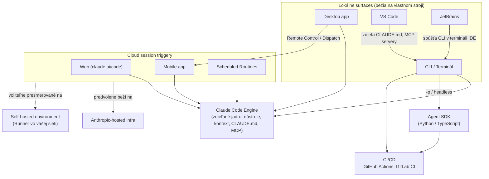
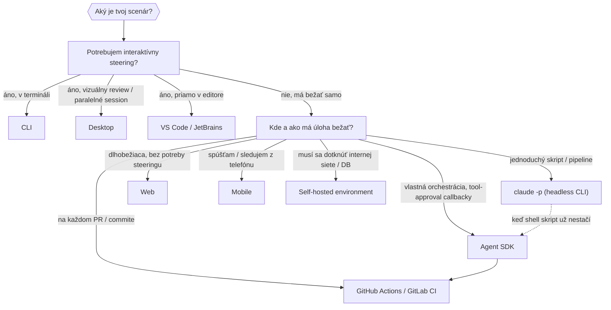

---
# 🧩 Versioning – systém dopĺňa automaticky
fm_version: "1.0.1"

# Dátum buildu – generuje skript
fm_build: "2026-09-01T10:38:11.431935+00:00"

# Poznámka k verzii – voliteľné
fm_version_comment: ""

# 🆔 IDENTITY --------------------------------------------------------

# ID generuje CLI / skript
id: "K000113"

# Unikátne UUID – generuje skript
guid: "21e590ae-2a18-4a02-b6bb-f1149b9cb4c3"

# 🧭 CONTEXT ---------------------------------------------------------

# DAO / doména (knife, sdlc, q12, 7ds...) dopĺňa skript
dao: "knife"

# Názov zápisu – dopĺňa používateľ
title: "K000113 – Claude Code (CC) — platformy a orchestrácia agentov"

# Krátky popis – dopĺňa používateľ (voliteľné)
description: "Prehľad povrchov Claude Code (CLI, Desktop, VS Code, JetBrains, Web, Mobile) a stupňov orchestrácie od headless scriptingu (`claude -p`) cez Agent SDK a CI/CD integrácie až po self-hosted environments — s rozhodovacou tabuľkou, kedy použiť ktorú vrstvu."

# 👥 AUTHORSHIP ------------------------------------------------------

# Hlavný autor – z globálneho configu
author: "Roman Kazicka"

# Zoznam autorov – generuje skript
authors:
  - "Roman Kazicka"

# 🗂 CLASSIFICATION ---------------------------------------------------

# Nadradená kategória – môže doplniť používateľ
category: "KNIFE"

# Typ dokumentu (guide, case, tutorial...) – používateľ (voliteľné)
type: "guide"

# Priorita (low/medium/high) – voliteľné
priority: "medium"

# Tagy – odporúča sa 2–6 tagov.
# Typy tagov:
#   - rámce: knife, 7ds, sdlc, q12
#   - účel: tutorial, guide, pattern, case-study
#   - téma: git, backup, ai, communication
#   - úroveň: beginner, intermediate, advanced
tags: [claude-code, ai, orchestracia, cli, devops]

# 🌍 LOCALIZATION -----------------------------------------------------

# Jazyk dokumentu – doplní skript podľa štruktúry
locale: "sk"

# 🕒 LIFECYCLE --------------------------------------------------------

# Dátum vytvorenia – generuje skript
created: "2026-09-01 12:38"

# Dátum poslednej úpravy – dopĺňa človek
modified: "2026-09-01 13:10"

# Stav dokumentu – default "backlog"
status: "published"

# Viditeľnosť – default "public"
privacy: "public"

# ⚖ INTELLECTUAL PROPERTY -------------------------------------------

# Držiteľ práv k obsahu – dopĺňa skript
rights_holder_content: "Roman Kazicka"

# Systémový vlastník práv
rights_holder_system: "CAA / KNIFE / LetItGrow"

# Licencia
license: "CC-BY-NC-SA-4.0"

# Disclaimer
disclaimer: "Use at your own risk. Methods provided as-is; participation is voluntary and context-aware."

# Copyright
copyright: "© 2026 Roman Kazicka"

# 🔗 ORIGIN / PROVENANCE ---------------------------------------------

# Repozitár pôvodu
origin_repo: ""

# URL pôvodného repozitára
origin_repo_url: ""

# Commit pôvodu
origin_commit: ""

# Branch pôvodu
origin_branch: ""

# Systém pôvodu (CAA/KNIFE/STHDF…)
origin_system: "CAA"

# Pôvodný autor
origin_author: "Roman Kazicka"

# Importovaný zdroj
origin_imported_from: ""

# Dátum importu
origin_import_date: ""

# 🧱 RESERVED ---------------------------------------------------------

fm_reserved1: ""
fm_reserved2: ""
---

# K000113 – Claude Code (CC) — platformy a orchestrácia agentov

> **KNIFE** – Knowledge In Friendly Examples
> **Séria:** Systemic Thinking in IT & Digital Fabrication
> **Úroveň:** Stredná
> **Tagy:** `claude-code` `ai` `orchestracia` `cli` `devops`

## 🎯 Čo rieši (účel, cieľ)

Claude Code má šesť povrchov (CLI, Desktop, VS Code, JetBrains, Web, Mobile) a minimálne štyri vrstvy orchestrácie (headless CLI, Agent SDK, CI/CD, self-hosted environments). Kto pozná len jednu vrstvu — napríklad interaktívne CLI — nevidí, že tá istá práca sa dá skriptovať, spúšťať v CI pipeline alebo nasadiť do vlastnej infraštruktúry. Tento KNIFE mapuje všetky povrchy a stupne orchestrácie na jednu rozhodovaciu tabuľku, aby výber "ktorý nástroj na akú úlohu" nebol pokus-omyl.

## 🧩 Ako to rieši (princíp)

Claude Code beží na spoločnom **"engine"** naprieč všetkými povrchmi — konfigurácia, `CLAUDE.md` a MCP servery sú medzi lokálnymi povrchmi zdieľané [1][2]. Z pohľadu architektúry ide o jedno jadro (nástroje, kontext, pamäť) a viacero vstupných bodov naň napojených:

- **Lokálne surfaces** (CLI, Desktop, VS Code, JetBrains) bežia na vlastnom stroji a zdieľajú `CLAUDE.md` aj MCP servery.
- **Cloud session triggery** (Web, Mobile, Scheduled Routines) spúšťajú beh predvolene na Anthropic-hosted infraštruktúre — voliteľne presmerovateľný na self-hosted environment.
- Z CLI vedie headless režim (`-p`) k **Agent SDK**, ktorý ďalej napája **CI/CD** pipeline.

## 🧪 Ako to použiť (aplikácia)

### Scenárová mapa (diagram)

Rovnaká rozhodovacia logika ako tabuľka nižšie, len ako priechodný diagram — od otázky "aký mám scenár?" k odporúčanému nástroju.

### Rozhodovacia tabuľka

| Potreba | Riešenie |
|---|---|
| Interaktívna práca v termináli | CLI |
| Vizuálny review diffov, paralelné session | Desktop |
| Práca priamo v editore | VS Code / JetBrains |
| Dlhobežiaca úloha bez steeringu | Web |
| Spúšťanie/monitoring z telefónu | Mobile |
| Skriptovaná automatizácia, jednoduchý pipeline | `claude -p` (headless CLI) |
| Vlastná orchestrácia viacerých agentov s plnou kontrolou | Agent SDK (Python/TypeScript) |
| Automatizácia v CI pipeline | GitHub Actions / GitLab CI |
| Cloud session musí bežať vo vlastnej sieti (compliance, interné služby) | Self-hosted environments |

### Friendly example

Tím potrebuje: (1) niekoho, kto počas dňa vizuálne prechádza diffy a preview appky → **Desktop**. (2) nočný job, ktorý po každom PR spustí review a napíše komentár → **GitHub Actions** volajúce `claude -p --output-format json`. (3) viackrokový pipeline review → fix → test, ktorý si musí pamätať kontext medzi krokmi → `--resume <session_id>` v tom istom skripte. (4) beh, ktorý sa musí dotknúť internej databázy za firewallom → **self-hosted environment** s runnerom vo vlastnej sieti namiesto Anthropic-hosted cloud session. Štyri rôzne potreby, štyri rôzne vrstvy tej istej platformy — nie štyri rôzne nástroje.

---

## ⚡ Rýchly návod (Top)

Otázky pred voľbou vrstvy:

1. Potrebujem interaktívny steering, alebo má úloha bežať sama? → CLI/Desktop vs. Web/headless.
2. Skriptujem jednorazový pipeline, alebo potrebujem vlastné tool-approval callbacky a typované výstupy? → `claude -p` vs. Agent SDK.
3. Beží to v CI na cudzom stroji každý beh nanovo? → pridaj `--bare` (bez auto-discovery hookov/MCP/`CLAUDE.md`) + `--allowedTools`/`--permission-mode` pre neinteraktívny beh.
4. Musí sa úloha dotknúť internej siete/databázy, kde Anthropic infra nemá prístup? → self-hosted environment (len priame Anthropic API, nie Bedrock/Vertex/Foundry, repozitáre len z GitHubu).
5. Potrebujem strom volaní naprieč subagentmi na debugovanie? → `--output-format stream-json`, správy nesú `parent_tool_use_id`.

## 📜 Detailný článok

### Platformy — kedy použiť ktorú

| Platforma | Najlepšie pre | Čo získaš |
|---|---|---|
| CLI | Terminálový workflow, scripting, vzdialené servery | Plná funkcionalita, Agent SDK, computer use na macOS (Pro/Max), third-party provideri |
| Desktop | Vizuálny review, paralelné session, spravovaný setup | Diff viewer, app preview, computer use, Dispatch (Pro/Max) |
| VS Code | Práca v editore bez prepínania do terminálu | Inline diffy, integrovaný terminál, file context |
| JetBrains | IntelliJ, PyCharm, WebStorm a i. | Diff viewer, zdieľanie výberu, terminál session |
| Web | Dlho bežiace úlohy, ktoré nepotrebujú veľa steeringu | Cloud, predvolene na Anthropic infra, beží aj po odpojení |
| Mobile | Spúšťanie/monitoring úloh mimo počítača | Cloud session z appky, Remote Control pre lokálne session, Dispatch na Desktop (Pro/Max) |

Zdroj tabuľky: [2]

### Headless mode a scripting (`claude -p`)

Základná stavebná jednotka pre orchestráciu cez vlastné skripty [3]:

- **`claude -p "prompt" --output-format json`** — štruktúrovaný výstup (result, session_id, cost breakdown), dá sa parsovať cez `jq` a chainovať do ďalších krokov.
- **`--output-format stream-json`** — streamovanie eventov v reálnom čase; správy subagentov nesú `parent_tool_use_id`, takže sa dá rekonštruovať celý strom volaní naprieč viacerými agentmi.
- **`--continue` / `--resume <session_id>`** — pokračovanie v konkrétnej konverzácii naprieč viacerými skriptovými volaniami (viackrokové pipeline: review → fix → test).
- **`--bare`** — odporúčaný mód pre CI/skripty; vynecháva auto-discovery hookov, MCP serverov a CLAUDE.md → deterministický výsledok na každom stroji.
- **`--allowedTools` / `--permission-mode dontAsk|auto|acceptEdits`** — auto-approve nástrojov bez interaktívneho promptu, nutné pre neinteraktívny beh.
- Exit kódy (0 = úspech, non-zero = zlyhanie) umožňujú skriptom vetviť logiku.

### Agent SDK — plná programová kontrola

Keď `claude -p` volané zo shell skriptu prestane stačiť (potrebné callbacky na tool approval, natívne message objekty, typované štruktúrované výstupy), nastupuje **Agent SDK** — Python a TypeScript balíky postavené na tej istej agentovej slučke a nástrojoch ako Claude Code [3][1]. Je to CLI-only funkcia — inštaluje a spúšťa sa z toho istého ekosystému.

Claude Code má aj vstavané **subagents** a **background agents** (paralelné behy koordinované lead agentom) — časť orchestrácie tak nie je nutné stavať ručne od nuly [1].

### CI/CD integrácie

| Integrácia | Čo robí |
|---|---|
| GitHub Actions | Spúšťa Claude v CI pipeline — automatizovaný PR review, issue triage, plánovaná údržba |
| GitLab CI/CD | To isté pre GitLab |
| Code Review | Automatický review na každom PR |

Zdroj: [1][2]

### Self-hosted environments — deployment do vlastnej infraštruktúry

Pre scenár, kde **cloud session** (spustená z Web/Mobile/Desktop/`claude --cloud`/scheduled routines) musí bežať vo vlastnej sieti (interné služby, databázy, compliance) — beta na Team/Enterprise pláne [4]:

- **Environment** — logická skupina runnerov, vytvorená v admin nastaveniach claude.ai.
- **Runner** — dlhobežiaci proces vo vašej infraštruktúre (obdoba self-hosted CI runnera); pollinguje `api.anthropic.com`, klonuje repo, spúšťa lokálny Claude Code proces.
- **Session** — jedna úloha; child proces streamuje eventy späť cez HTTPS.

Kľúčové vlastnosti: všetka komunikácia je **outbound** (Anthropic sa nikdy nepripája dovnútra vašej siete), podpora autoscaling orchestrátora, Kubernetes/Compose recepty, wrapper skripty pre per-session credentials a lifecycle hooky. Obmedzenia: inference len cez priame Anthropic API (nie cez Bedrock/Vertex/Foundry/LLM gateway), nekompatibilné so Zero Data Retention, repozitáre len z GitHubu [4].

## 💡 Tipy a poznámky

- V CI vždy pridaj `--bare` — bez neho skript potiahne lokálne hooky/MCP servery a beh na inom stroji môže dopadnúť inak.
- `--resume <session_id>` je lacnejší spôsob viackrokového pipeline (review → fix → test) než reštartovať kontext v každom kroku nanovo.
- Self-hosted environment nie je "self-hosted model" — inference stále ide cez priame Anthropic API, mení sa len to, kde beží runner a odkiaľ sa klonuje repo.
- Vstavané subagents/background agents kryjú časť potrieb, na ktoré by inak bolo treba stavať vlastnú orchestráciu nad Agent SDK.

## ✅ Hodnota / Zhrnutie

Claude Code nie je jeden nástroj, ale jedno jadro s viacerými vstupnými bodmi. Voľba povrchu (CLI/Desktop/VS Code/JetBrains/Web/Mobile) rieši otázku "kde a ako s tým pracujem"; voľba orchestračnej vrstvy (`claude -p` → Agent SDK → CI/CD → self-hosted) rieši otázku "ako to zautomatizujem a kde to musí bežať". Rozhodovacia tabuľka v sekcii "Ako to použiť" je skratka na obe otázky naraz.

## Zdroje

[1] https://code.claude.com/docs/en/overview

[2] https://code.claude.com/docs/en/platforms

[3] https://code.claude.com/docs/en/headless

[4] https://code.claude.com/docs/en/self-hosted-environments

<!-- body:start -->

<!-- nav:knifes -->
> [⬅ KNIFES – Prehľad](../knifes_overview/KNIFE_Overview_Blog.md) • [Zoznam](../knifes_overview/KNIFE_Overview_List.md) • [Detaily](../knifes_overview/KNIFE_Overview_Details.md)
---
