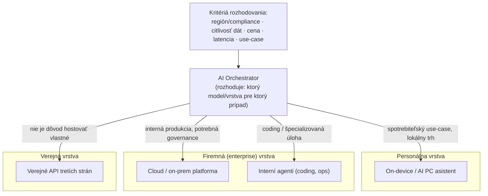

---
# 🧩 Versioning – systém dopĺňa automaticky
fm_version: "1.0.1"

# Dátum buildu – generuje skript
fm_build: "2026-09-07T09:41:01.939107+00:00"

# Poznámka k verzii – voliteľné
fm_version_comment: ""

# 🆔 IDENTITY --------------------------------------------------------

# ID generuje CLI / skript
id: "K000114"

# Unikátne UUID – generuje skript
guid: "c6628d37-dd8e-4297-a9ef-b46e87cdd68d"

# 🧭 CONTEXT ---------------------------------------------------------

# DAO / doména (knife, sdlc, q12, 7ds...) dopĺňa skript
dao: "knife"

# Názov zápisu – dopĺňa používateľ
title: "K000114 – Hybrid AI ako architektonický vzor"

# Krátky popis – dopĺňa používateľ (voliteľné)
description: "Prečo jeden model/jedna platforma na celý podnik nestačí — architektonický vzor, ktorý delí AI stack na personálnu, firemnú a verejnú vrstvu a explicitne rieši, kto (AI Orchestrator) a podľa akých kritérií rozhoduje, ktorá vrstva sa použije kde. Ilustrované na Lenovo (Qira/DeepSeek vs. enterprise infraštruktúra)."

# 👥 AUTHORSHIP ------------------------------------------------------

# Hlavný autor – z globálneho configu
author: "Roman Kazicka"

# Zoznam autorov – generuje skript
authors:
  - "Roman Kazicka"

# 🗂 CLASSIFICATION ---------------------------------------------------

# Nadradená kategória – môže doplniť používateľ
category: "KNIFE"

# Typ dokumentu (guide, case, tutorial...) – používateľ (voliteľné)
type: "pattern"

# Priorita (low/medium/high) – voliteľné
priority: "medium"

# Tagy – odporúča sa 2–6 tagov.
# Typy tagov:
#   - rámce: knife, 7ds, sdlc, q12
#   - účel: tutorial, guide, pattern, case-study
#   - téma: git, backup, ai, communication
#   - úroveň: beginner, intermediate, advanced
tags: [ai, architecture, orchestration, enterprise, hybrid-ai]

# 🌍 LOCALIZATION -----------------------------------------------------

# Jazyk dokumentu – doplní skript podľa štruktúry
locale: "sk"

# 🕒 LIFECYCLE --------------------------------------------------------

# Dátum vytvorenia – generuje skript
created: "2026-09-07 11:41"

# Dátum poslednej úpravy – dopĺňa človek
modified: "2026-09-07 11:41"

# Stav dokumentu – default "backlog"
status: "inProgress"

# Viditeľnosť – default "public"
privacy: "public"

# ⚖ INTELLECTUAL PROPERTY -------------------------------------------

# Držiteľ práv k obsahu – dopĺňa skript
rights_holder_content: "Roman Kazicka"

# Systémový vlastník práv
rights_holder_system: "CAA / KNIFE / LetItGrow"

# Licencia
license: "CC-BY-NC-SA-4.0"

# Disclaimer
disclaimer: "Use at your own risk. Methods provided as-is; participation is voluntary and context-aware."

# Copyright
copyright: "© 2025 Roman Kazicka"

# 🔗 ORIGIN / PROVENANCE ---------------------------------------------

# Repozitár pôvodu
origin_repo: ""

# URL pôvodného repozitára
origin_repo_url: ""

# Commit pôvodu
origin_commit: ""

# Branch pôvodu
origin_branch: ""

# Systém pôvodu (CAA/KNIFE/STHDF…)
origin_system: "CAA"

# Pôvodný autor
origin_author: "Roman Kazicka"

# Importovaný zdroj
origin_imported_from: ""

# Dátum importu
origin_import_date: ""

# 🧱 RESERVED ---------------------------------------------------------

fm_reserved1: ""
fm_reserved2: ""
---

# K000114 – Hybrid AI ako architektonický vzor

> **KNIFE** – Knowledge In Friendly Examples
> **Séria:** Systemic Thinking in IT & Digital Fabrication
> **Úroveň:** Stredná
> **Tagy:** `ai` `architecture` `orchestration` `enterprise` `hybrid-ai`

:::caution In Progress
Tento KNIFE je rozpracovaný. Vzor je odvodený z jedného konkrétneho prípadu (Lenovo, pozri Zdroje) — zovšeobecnenie na "univerzálny architektonický vzor" ešte čaká na overenie na druhom/treťom nezávislom prípade.
:::

## 🎯 Čo rieši (účel, cieľ)

Bežná (chybná) predstava je, že podnik si "vyberie AI platformu" — jeden model, jeden cloud, jeden vendor — a tým je otázka vyriešená. V praxi veľké organizácie čoraz častejšie zisťujú, že rôzne časti biznisu potrebujú **rôzne modely z rôznych dôvodov naraz**: spotrebiteľský produkt potrebuje lacný, rýchly, lokálne bežiaci model; firemný coding agent potrebuje najlepší možný model bez ohľadu na cenu; regulovaný trh potrebuje model, ktorý spĺňa miestnu compliance. Ak sa táto voľba nerobí vedome a architektonicky, vznikne buď (a) chaos — každý tím si vyberie inak, bez spoločnej governance, alebo (b) falošná uniformita — firma sa nasilu drží jedného vendora aj tam, kde to nedáva zmysel, a stráca na cene, výkone alebo compliance.

Tento KNIFE pomenúva vzor, ktorým sa dá táto voľba urobiť opakovateľne: **Hybrid AI** ako explicitná trojvrstvová architektúra s jednou rozhodovacou vrstvou navrchu.

## 🧩 Ako to rieši (princíp)

Vzor rozdeľuje AI stack organizácie na tri vrstvy podľa toho, **kde a pre koho** model beží, a pridáva štvrtú — orchestračnú — vrstvu, ktorá medzi nimi rozhoduje:

- **Personálna vrstva** — on-device / spotrebiteľský AI naviazaný na konkrétne zariadenie alebo osobu (asistent v telefóne, AI PC). Optimalizuje sa na latenciu, cenu na used a lokálny trh.
- **Firemná (enterprise) vrstva** — cloud/on-prem infraštruktúra pre interné produktívne nasadenia (coding agenti, interné nástroje, zákaznícke systémy). Optimalizuje sa na výkon, governance, audit trail.
- **Verejná vrstva** — modely tretích strán, ku ktorým firma nemá priamu kontrolu nad hostingom (verejné API veľkých poskytovateľov), použité tam, kde vlastná infraštruktúra nedáva zmysel.
- **Orchestračná vrstva (AI Orchestrator)** — explicitná rozhodovacia funkcia (rola alebo systém), ktorá pre daný prípad použitia vyberie správnu kombináciu vyššie uvedených vrstiev podľa merateľných kritérií: región/compliance, citlivosť dát, cena, latencia, use-case.

Kľúčový bod: vzor nehovorí "použi jeden model" ani "použi ľubovoľný model kdekoľvek" — hovorí, že **voľba modelu/vrstvy má byť výstupom rozhodovacej funkcie s explicitnými kritériami**, nie ad-hoc rozhodnutím jednotlivého tímu ani firemnou politikou "všetko cez jedného vendora".

## 🧪 Ako to použiť (aplikácia)

### Friendly example — Lenovo

Lenovo tento vzor reálne prevádzkuje, hoci ho takto oficiálne nepomenúva — firma otvorene komunikuje stratégiu "Hybrid AI": personálne, firemné a verejné modely majú fungovať ako prepojené "digitálne dvojčatá" [1].

| Vrstva | Čo Lenovo použije | Prečo |
|---|---|---|
| Personálna | Qira (globálne) / Xiaotian (Čína) — plná integrácia DeepSeek-R1 [3][4] | Čínsky trh, spotrebiteľská cena/výkon, žiadna enterprise governance záťaž |
| Firemná (enterprise) | Intel Core Ultra, NVIDIA AI Cloud Gigafactory, AMD EPYC (ThinkSystem) [1][2] | Enterprise zákazníci mimo Číny očakávajú západný stack, audit trail, existujúce partnerstvá |
| Verejná | pravdepodobne OpenAI/Microsoft (Copilot+ PC ekosystém) | Windows AI PC štandard, mimo priamej kontroly Lenova |
| Orchestrátor | rola "AI Orchestrator" (BA & AI Orchestrator pozícia) | Niekto musí rozhodovať, ktorý stack ísť nasadiť pre ktorý trh/zákazku |

Rovnaký princíp platí aj mimo Lenova: use-case "coding agent" má v enterprise segmente jasne inú optimálnu voľbu (Anthropic drží 54 % podielu enterprise coding výdavkov [9]) než use-case "spotrebiteľský asistent" — a organizácia, ktorá si vynúti jeden model na oboje, stráca na oboch frontoch.

### Rozhodovacia tabuľka (všeobecná)

| Kritérium | Smeruje k Personálnej vrstve | Smeruje k Firemnej vrstve | Smeruje k Verejnej vrstve |
|---|---|---|---|
| Citlivosť dát | nízka (lokálne zariadenie) | vysoká, potrebná governance | závisí od poskytovateľa |
| Región/compliance | lokálny trh s vlastnými pravidlami | regulované odvetvie (fin, health) | žiadna špecifická požiadavka |
| Cena na used | musí byť nízka (milióny zariadení) | vyššia OK, výkon > cena | podľa API cenníka |
| Use-case | asistent, personalizácia | coding, interné nástroje, agenti | rýchly prototyp, nekritický nástroj |

## ⚡ Rýchly návod (Top)

Otázky pred návrhom AI architektúry organizácie:

1. Máme explicitnú rolu/funkciu, ktorá rozhoduje "ktorý model kde", alebo si to každý tím vyberá sám? → ak druhé, chýba orchestračná vrstva.
2. Je voľba modelu naviazaná na merateľné kritériá (compliance, cena, citlivosť dát, use-case), alebo len na "čo firma práve preferuje"?
3. Máme use-case, kde jeden vendor jasne vedie (napr. coding) a napriek tomu ho nepoužívame, lebo "musíme byť konzistentní"? → over si, či je to skutočné obmedzenie, alebo zotrvačnosť.
4. Vieme pomenovať, ktorá vrstva (personálna/firemná/verejná) rieši ktorý typ potreby v našej organizácii?

## 📜 Detailný článok

### Prečo trojvrstvový model, nie jeden stack

Enterprise LLM trh sám osebe ukazuje, prečo "jeden model na všetko" nie je len architektonicky nečisté, ale aj ekonomicky nevýhodné rozhodnutie. Podľa Menlo Ventures (~500 amerických enterprise rozhodovateľov, nov. 2025) drží Anthropic 40 % enterprise LLM výdavkov (nárast zo 24 % v 2024 a 12 % v 2023), OpenAI kleslo z 50 % (2023) na 27 %, Google narástlo zo 7 % na 21 % [9]. V segmente coding je rozdiel ešte výraznejší — Anthropic 54 % vs. OpenAI 21 % [9]. Toto nie je náhodný pohyb trhu — je to dôkaz, že **rôzne use-case majú rôznych "najlepších" poskytovateľov v danom momente**, a firma, ktorá si vyberie jeden model naprieč všetkými use-case, systematicky podvýkonáva v niektorých z nich.

### Orchestrátor nie je len technická funkcia

Dôležité je nezredukovať "AI Orchestrator" na technický routing layer (round-robin medzi API). Rozhodnutia, ktoré táto vrstva robí, majú priamy dopad na governance, náklady a compliance — čo z nej robí skôr **architektonicko-biznisovú rolu** (odtiaľ aj kombinovaný titul "Business Analyst & AI Orchestrator"). Rovnaký prieskum upozorňuje, že len 16 % enterprise nasadení je "skutočný" agent (plánuje, vykonáva, adaptuje sa) — zvyšok sú fixed-sequence workflow okolo jedného LLM volania [9]. To znamená, že "orchestrácia" v praxi často znamená menej sofistikovaný, ale merateľnejší a lacnejší dizajn, než naznačuje agent-hype.

### Vzťah k orchestrácii nástrojov (nie len modelov)

Rovnaký princíp — jedno jadro/rozhodovacia vrstva navrchu, viacero vstupných bodov/vrstiev pod ňou — sa objavuje aj na inej úrovni: pri orchestrácii samotných AI nástrojov (nie len modelov, ktoré vyberáme). Pozri [[K000113-CC-Platformy-Orchestracia|K000113 – Claude Code: platformy a orchestrácia agentov]] pre analogický vzor na vrstve vývojárskych nástrojov.

## 💡 Tipy a poznámky

- Trojvrstvový model nie je statický — hranice medzi personálnou/firemnou/verejnou vrstvou sa menia (napr. keď sa dnes verejné API stane zajtra súčasťou vlastnej infraštruktúry po enterprise dohode).
- Riziko vendor lock-inu sa neznižuje "výberom jedného vendora", ale explicitnou orchestračnou vrstvou, ktorá dovolí meniť poskytovateľa per use-case bez prerábania celej architektúry.
- Pozor na náklady na komplexitu: udržiavanie troch vrstiev naraz má vlastnú prevádzkovú cenu (integrácie, testovanie, governance na každú vrstvu zvlášť) — vzor sa oplatí až od určitej veľkosti organizácie/portfólia use-case.
- Súvisiaci vzor pre regionálne/regulatórne rozdelenie (nie len "kde", ale "pre koho podľa akých pravidiel") je rozpracovaný samostatne — pozri [[K000115-Dual-Stack-AI-Compliance|K000115 – Dual-stack AI compliance ako enterprise architektonická požiadavka]].

## ✅ Hodnota / Zhrnutie

Hybrid AI nie je marketingový termín, ale pomenovateľný architektonický vzor: tri vrstvy (personálna/firemná/verejná) plus jedna explicitná rozhodovacia vrstva (AI Orchestrator) s merateľnými kritériami. Firma, ktorá tento vzor nemá pomenovaný, robí tie isté rozhodnutia beztak — len implicitne, tím po tíme, bez konzistencie a bez možnosti auditovať prečo bol ktorý model kde nasadený.

## Zdroje

[1] https://news.lenovo.com/pressroom/press-releases/hybrid-ai-personalized-perceptive-proactive-ai-portfolio-tech-world-ces-2026/

[2] https://futurumgroup.com/insights/lenovos-ai-strategy-drives-enterprise-transformation-in-a-crowded-market/

[3] https://www.channelnews.com.au/lenovo-goes-all-in-with-deepseek-for-notebooks-motorola-smartphones/

[4] https://longbridge.com/en/news/228701820

[9] https://menlovc.com/perspective/2025-the-state-of-generative-ai-in-the-enterprise/

Podrobnejšie trhové dáta k tomuto prípadu: interný podklad *AI trh 2026 — Client vs Enterprise segmenty (Lenovo)*, `content/docs/sk/knifes/_unclasified/AI-trh-2026-client-vs-enterprise-Lenovo.md`.

<!-- body:start -->

<!-- nav:knifes -->
> [⬅ KNIFES – Prehľad](../knifes_overview/KNIFE_Overview_Blog.md) • [Zoznam](../knifes_overview/KNIFE_Overview_List.md) • [Detaily](../knifes_overview/KNIFE_Overview_Details.md)
---
