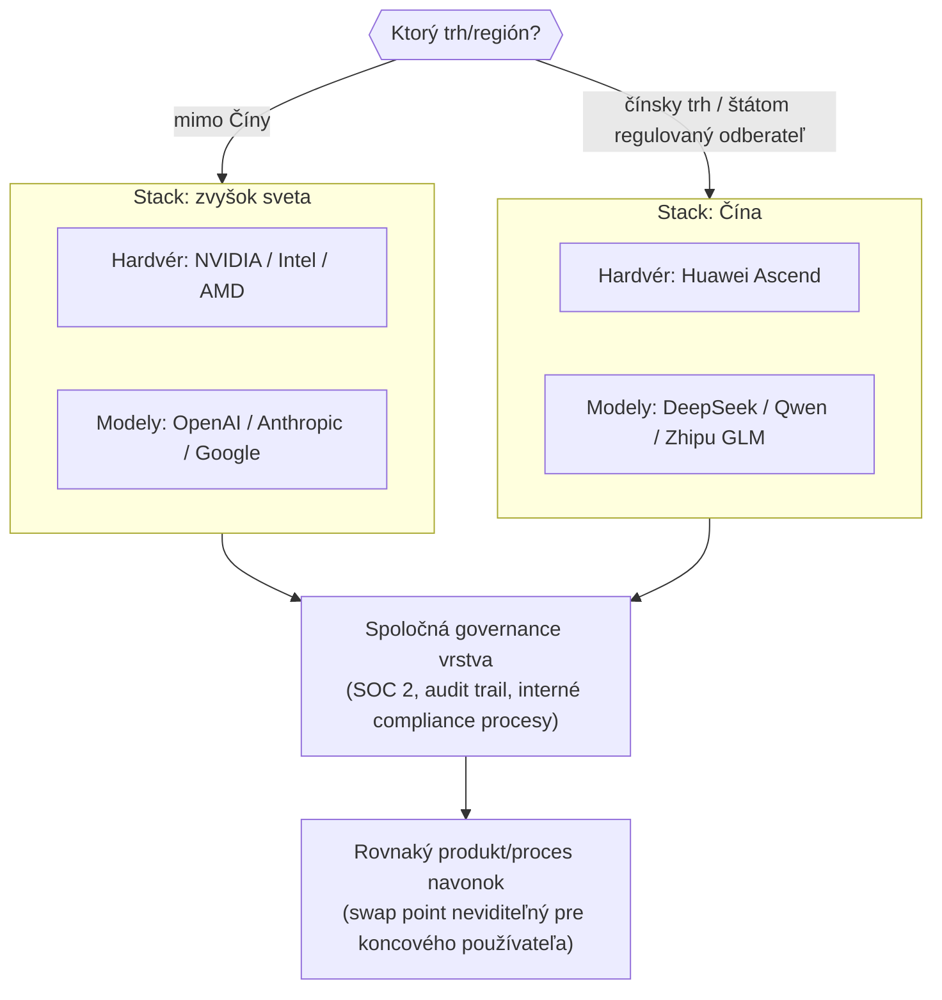

---
# 🧩 Versioning – systém dopĺňa automaticky
fm_version: "1.0.1"

# Dátum buildu – generuje skript
fm_build: "2026-09-07T09:41:02.047412+00:00"

# Poznámka k verzii – voliteľné
fm_version_comment: ""

# 🆔 IDENTITY --------------------------------------------------------

# ID generuje CLI / skript
id: "K000116"

# Unikátne UUID – generuje skript
guid: "9fe6fcd3-e37d-4232-b7bf-32d622f70015"

# 🧭 CONTEXT ---------------------------------------------------------

# DAO / doména (knife, sdlc, q12, 7ds...) dopĺňa skript
dao: "knife"

# Názov zápisu – dopĺňa používateľ
title: "K000116 – Dual-stack AI compliance ako enterprise architektonická požiadavka"

# Krátky popis – dopĺňa používateľ (voliteľné)
description: "Prečo si globálna firma pôsobiaca v Číne aj mimo nej nemôže vystačiť s jedným AI hardvérovo-softvérovým stackom — export controls a geopolitika menia 'jeden stack pre všetky trhy' na architektonické riziko. Vzor: dual-stack ako explicitná návrhová požiadavka, nie neskoré záplatovanie. Ilustrované na Lenovo a kolapse podielu Nvidia na čínskom AI čipovom trhu."

# 👥 AUTHORSHIP ------------------------------------------------------

# Hlavný autor – z globálneho configu
author: "Roman Kazicka"

# Zoznam autorov – generuje skript
authors:
  - "Roman Kazicka"

# 🗂 CLASSIFICATION ---------------------------------------------------

# Nadradená kategória – môže doplniť používateľ
category: "KNIFE"

# Typ dokumentu (guide, case, tutorial...) – používateľ (voliteľné)
type: "pattern"

# Priorita (low/medium/high) – voliteľné
priority: "medium"

# Tagy – odporúča sa 2–6 tagov.
# Typy tagov:
#   - rámce: knife, 7ds, sdlc, q12
#   - účel: tutorial, guide, pattern, case-study
#   - téma: git, backup, ai, communication
#   - úroveň: beginner, intermediate, advanced
tags: [ai, architecture, compliance, geopolitics, enterprise]

# 🌍 LOCALIZATION -----------------------------------------------------

# Jazyk dokumentu – doplní skript podľa štruktúry
locale: "sk"

# 🕒 LIFECYCLE --------------------------------------------------------

# Dátum vytvorenia – generuje skript
created: "2026-09-07 11:41"

# Dátum poslednej úpravy – dopĺňa človek
modified: "2026-09-07 11:41"

# Stav dokumentu – default "backlog"
status: "inProgress"

# Viditeľnosť – default "public"
privacy: "public"

# ⚖ INTELLECTUAL PROPERTY -------------------------------------------

# Držiteľ práv k obsahu – dopĺňa skript
rights_holder_content: "Roman Kazicka"

# Systémový vlastník práv
rights_holder_system: "CAA / KNIFE / LetItGrow"

# Licencia
license: "CC-BY-NC-SA-4.0"

# Disclaimer
disclaimer: "Use at your own risk. Methods provided as-is; participation is voluntary and context-aware."

# Copyright
copyright: "© 2025 Roman Kazicka"

# 🔗 ORIGIN / PROVENANCE ---------------------------------------------

# Repozitár pôvodu
origin_repo: ""

# URL pôvodného repozitára
origin_repo_url: ""

# Commit pôvodu
origin_commit: ""

# Branch pôvodu
origin_branch: ""

# Systém pôvodu (CAA/KNIFE/STHDF…)
origin_system: "CAA"

# Pôvodný autor
origin_author: "Roman Kazicka"

# Importovaný zdroj
origin_imported_from: ""

# Dátum importu
origin_import_date: ""

# 🧱 RESERVED ---------------------------------------------------------

fm_reserved1: ""
fm_reserved2: ""
---

# K000116 – Dual-stack AI compliance ako enterprise architektonická požiadavka

> **KNIFE** – Knowledge In Friendly Examples
> **Séria:** Systemic Thinking in IT & Digital Fabrication
> **Úroveň:** Stredná až pokročilá
> **Tagy:** `ai` `architecture` `compliance` `geopolitics` `enterprise`

:::caution In Progress
Tento KNIFE je rozpracovaný. Geopolitické prognózy (napr. podiel Nvidia na čínskom trhu) sú z jedného zdroja k septembru 2026 a menia sa rýchlo — pred použitím v inom kontexte over aktuálny stav.
:::

## 🎯 Čo rieši (účel, cieľ)

Bežný predpoklad enterprise architektúry znie: "AI stack navrhneme raz, nasadíme všade." Pre globálnu firmu pôsobiacu súčasne na čínskom aj nečínskom trhu tento predpoklad neplatí — a čoraz menej ide o voľbu, čoraz viac o vynútenú nutnosť. Americké exportné obmedzenia na pokročilé AI čipy a súbežný nástup domácich čínskych alternatív (Huawei Ascend) znamenajú, že **jeden hardvérovo-softvérový AI stack fyzicky nemôže obsluhovať oba trhy naraz** — nie z dôvodu preferencie, ale z dôvodu dostupnosti a regulácie.

Firmy, ktoré túto realitu neriešia architektonicky vopred, ju riešia neskôr ako núdzové záplatovanie (samostatné, zle koordinované čínske vetvy produktu, duplicitný kód, nekonzistentná governance). Tento KNIFE pomenúva vzor, ktorý premieňa dual-stack z núdzového riešenia na explicitnú, od začiatku navrhnutú architektonickú požiadavku.

## 🧩 Ako to rieši (princíp)

Vzor stavia na jednoduchom princípe z architektúry systémov: **oddeliť to, čo sa musí líšiť podľa regiónu (stack), od toho, čo môže zostať spoločné (governance a orchestrácia nad stackom)**. Namiesto toho, aby región prenikal do každej vrstvy systému ad-hoc, sa vytvorí jeden explicitný "swap point" — miesto v architektúre, kde sa podľa regiónu/trhu zapojí buď západný, alebo čínsky stack, bez zmeny zvyšku systému.

Kľúčové je, že **governance vrstva zostáva jedna** — mení sa len to, ktorý konkrétny hardvér/model je pod ňou zapojený. Bez tohto oddelenia sa región prepíše do každej vrstvy zvlášť a údržba sa stane exponenciálne drahšou s každým ďalším regiónom.

## 🧪 Ako to použiť (aplikácia)

### Friendly example — Lenovo a kolaps podielu Nvidia v Číne

Konkrétny geopolitický spúšťač: podiel Nvidia na čínskom AI čipovom trhu sa má podľa prognóz prepadnúť **zo 40 % na približne 8 %**, keďže Huawei (Ascend čipy) rýchlo naberá podiel pod tlakom amerických exportných obmedzení [13]. Čínski enterprise poskytovatelia (napr. Zhipu/GLM-5) už trénujú modely priamo na Huawei Ascend namiesto Nvidia GPU [6]. Pre firmu ako Lenovo — globálny hráč s čínskymi koreňmi — to znamená, že "jeden enterprise AI stack" nie je realistická voľba:

| | Stack: zvyšok sveta | Stack: Čína |
|---|---|---|
| Hardvér | NVIDIA (AI Cloud Gigafactory), Intel, AMD [1][2] | Huawei Ascend [6][13] |
| Modely | pravdepodobne OpenAI/Microsoft/Anthropic podľa zákazníka | DeepSeek, Qwen, Zhipu GLM-5 [6] |
| Dôvod | enterprise zákazníci mimo Číny očakávajú tento ekosystém | exportné obmedzenia fyzicky blokujú Nvidia dodávky; domáci dodávatelia sú lacnejší a bez regulačného rizika |
| Governance | SOC 2, RBAC, audit trails — nutnosť pre regulované odvetvia [10] | lokálne compliance rámce, iný dôraz |

### Rozhodovacia tabuľka (všeobecná)

| Kritérium | Signál pre dual-stack | Signál, že jeden stack stačí |
|---|---|---|
| Export control na cieľový hardvér | áno, priamo dotknutý (napr. pokročilé GPU do Číny) | nie, žiadne obmedzenie |
| Typ zákazníka | štátom vlastnené / regulované subjekty [6] | súkromný sektor, žiadna štátna väzba |
| Dátová rezidencia | vyžadovaná lokálne | nie je vyžadovaná |
| Objem biznisu v druhom regióne | dostatočný na odôvodnenie duplicitnej údržby | okrajový, nerentabilné duplikovať |

## ⚡ Rýchly návod (Top)

Otázky pred rozhodnutím "potrebujeme dual-stack?":

1. Je náš primárny hardvér/model dotknutý existujúcimi alebo hroziacimi exportnými obmedzeniami v niektorom z našich cieľových trhov?
2. Máme jasne definovaný "swap point" v architektúre, kde sa dá stack vymeniť bez zásahu do zvyšku systému — alebo je región zapletený do každej vrstvy?
3. Je naša governance vrstva (audit, compliance procesy) nezávislá od konkrétneho hardvéru/modelu, alebo je s ním pevne zviazaná?
4. Kalkulovali sme si náklady na duplicitnú údržavu dvoch stackov oproti riziku nesplnenia exportných/compliance pravidiel?

## 📜 Detailný článok

### Prečo ide o architektonickú, nie len obchodnú otázku

Je lákavé vidieť dual-stack ako čisto obchodné/procurement rozhodnutie ("kúpime aj čínsky hardvér"). Problém nastáva, keď sa táto voľba nepremietne do architektúry vopred — vtedy sa región stáva skrytou závislosťou rozliatou naprieč kódom, konfiguráciou aj procesmi, namiesto jedného explicitného rozhodovacieho bodu. To isté riziko sa objavuje aj pri voľbe AI modelu/vrstvy v rámci jedného regiónu — pozri všeobecnejší vzor v [[K000115-Hybrid-AI-Architektonicky-Vzor|K000115 – Hybrid AI ako architektonický vzor]]; dual-stack compliance je jeho špecializovaný prípad pre os "región/export control", nie os "use-case".

### Governance gap ako vstupný bod pre rolu BA & AI Orchestrator

Podľa Futurum Group takmer všetky firmy (96 %) zvyšujú investície do AI, no len 27 % má komplexný governance rámec [2]. Tento rozdiel je presne miesto, kde dual-stack architektúra buď zlyhá (governance nestíha pribúdajúcim stackom), alebo funguje ako jej vlastný záchranný mechanizmus — ak je governance vrstva navrhnutá nezávisle od konkrétneho regionálneho stacku (pozri diagram vyššie), nový región/stack sa dá pridať bez toho, aby sa musela governance stavať odznova.

### Čo dual-stack nerieši

Dual-stack architektúra nerieši rozdiely v **jazykovom tóne, compliance postoji a enterprise tooling integráciách** medzi čínskymi a západnými modelmi — tieto zaostávajú aj pri technicky porovnateľnom výkone [6]. To znamená, že swap point v architektúre musí počítať aj s odlišnými prevádzkovými charakteristikami modelov na oboch stranách, nielen s odlišným hardvérom.

## 💡 Tipy a poznámky

- Dual-stack nie je len "2× ten istý stack" — čínsky a nečínsky stack majú typicky odlišné silné stránky (cena/výkon v coding vs. compliance/tooling), čo treba zohľadniť pri návrhu swap pointu, nie ho len mechanicky duplikovať.
- Náklady na údržbu dvoch stackov rastú s hĺbkou, do akej región preniká do architektúry — čím vyššie (bližšie ku governance vrstve) je swap point umiestnený, tým lacnejšia je dlhodobá údržba.
- Geopolitické prognózy (napr. 40 %→8 % podiel Nvidia v Číne) sa menia rýchlo — architektúra postavená na dual-stacku má byť odolná voči zmene pomeru, nie voči konkrétnemu číslu.
- Pozri aj všeobecnejší vzor [[K000115-Hybrid-AI-Architektonicky-Vzor|K000115]] pre orchestráciu naprieč vrstvami (personálna/firemná/verejná) — dual-stack rieši ortogonálnu os (región/export control), obe osi sa dajú kombinovať.

## ✅ Hodnota / Zhrnutie

Pre globálnu firmu pôsobiacu na čínskom aj nečínskom trhu nie je "jeden AI stack pre všetkých" udržateľná voľba — export controls a rozdielna dostupnosť hardvéru to fyzicky vylučujú. Dual-stack ako architektonický vzor rieši toto oddelením regionálneho stacku (hardvér + modely) od spoločnej governance vrstvy cez jeden explicitný swap point. Firma, ktorá toto oddelenie nemá navrhnuté vopred, ho bude riešiť neskôr ako drahé a rizikové záplatovanie.

## Zdroje

[1] https://news.lenovo.com/pressroom/press-releases/hybrid-ai-personalized-perceptive-proactive-ai-portfolio-tech-world-ces-2026/

[2] https://futurumgroup.com/insights/lenovos-ai-strategy-drives-enterprise-transformation-in-a-crowded-market/

[6] https://www.digitalapplied.com/blog/chinese-ai-models-q2-2026-market-share-report

[10] https://beam.ai/agentic-insights/ai-agents-in-2026-how-the-us-and-china-are-building-two-very-different-futures

[13] https://www.marketscale.com/industries/transportation/nvidias-china-ai-chip-share-is-forecast-to-collapse-from-40-to-8-as-huawei-scales

Podrobnejšie trhové dáta k tomuto prípadu: interný podklad *AI trh 2026 — Client vs Enterprise segmenty (Lenovo)*, `content/docs/sk/knifes/_unclasified/AI-trh-2026-client-vs-enterprise-Lenovo.md`.

<!-- body:start -->

<!-- nav:knifes -->
> [⬅ KNIFES – Prehľad](../knifes_overview/KNIFE_Overview_Blog.md) • [Zoznam](../knifes_overview/KNIFE_Overview_List.md) • [Detaily](../knifes_overview/KNIFE_Overview_Details.md)
---
