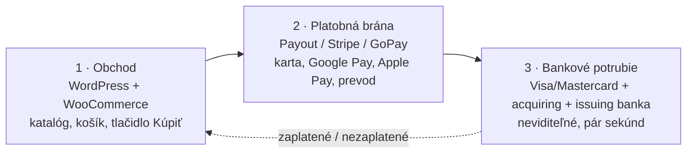
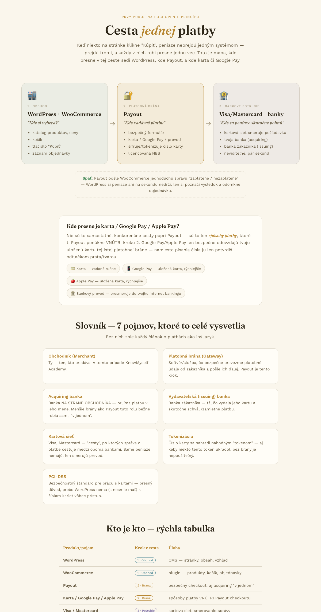

---
# 🧩 Versioning – systém dopĺňa automaticky
fm_version: "1.0.0"

# Dátum buildu – generuje skript
fm_build: "2026-09-10T00:00:00.000000+00:00"

# Poznámka k verzii – voliteľné
fm_version_comment: ""

# 🆔 IDENTITY --------------------------------------------------------

# ID generuje CLI / skript
id: "K000117"

# Unikátne UUID – generuje skript
guid: "74860c2e-5ebe-46bc-9c43-ad9d9b15d868"

# 🧭 CONTEXT ---------------------------------------------------------

# DAO / doména (knife, sdlc, q12, 7ds...) dopĺňa skript
dao: "knife"

# Názov zápisu – dopĺňa používateľ
title: "K000117 – Ako funguje platba online (Payment Gateway základy)"

# Krátky popis – dopĺňa používateľ (voliteľné)
description: "Konceptuálny prehľad online platby pre laikov aj obchodníkov — 3 kroky (obchod/CMS, platobná brána, bankové potrubie), kde presne sedí karta/Google Pay/Apple Pay, a slovník základných pojmov (acquiring/issuing banka, tokenizácia, PCI-DSS)."

# 👥 AUTHORSHIP ------------------------------------------------------

# Hlavný autor – z globálneho configu
author: "Roman Kazicka"

# Zoznam autorov – generuje skript
authors:
  - "Roman Kazicka"

# 🗂 CLASSIFICATION ---------------------------------------------------

# Nadradená kategória – môže doplniť používateľ
category: "KNIFE"

# Typ dokumentu (guide, case, tutorial...) – používateľ (voliteľné)
type: "guide"

# Priorita (low/medium/high) – voliteľné
priority: "low"

# Tagy – odporúča sa 2–6 tagov.
# Typy tagov:
#   - rámce: knife, 7ds, sdlc, q12
#   - účel: tutorial, guide, pattern, case-study
#   - téma: git, backup, ai, communication
#   - úroveň: beginner, intermediate, advanced
tags: [payments, e-commerce, woocommerce, beginner, fintech]

# 🌍 LOCALIZATION -----------------------------------------------------

# Jazyk dokumentu – doplní skript podľa štruktúry
locale: "sk"

# 🕒 LIFECYCLE --------------------------------------------------------

# Dátum vytvorenia – generuje skript
created: "2026-09-10 22:15"

# Dátum poslednej úpravy – dopĺňa človek
modified: "2026-09-10 22:15"

# Stav dokumentu – default "backlog"
status: "backlog"

# Viditeľnosť – default "public"
privacy: "public"

# ⚖ INTELLECTUAL PROPERTY -------------------------------------------

# Držiteľ práv k obsahu – dopĺňa skript
rights_holder_content: "Roman Kazicka"

# Systémový vlastník práv
rights_holder_system: "CAA / KNIFE / LetItGrow"

# Licencia
license: "CC-BY-NC-SA-4.0"

# Disclaimer
disclaimer: "Use at your own risk. Methods provided as-is; participation is voluntary and context-aware."

# Copyright
copyright: "© 2025 Roman Kazicka"

# 🔗 ORIGIN / PROVENANCE ---------------------------------------------

# Repozitár pôvodu
origin_repo: ""

# URL pôvodného repozitára
origin_repo_url: ""

# Commit pôvodu
origin_commit: ""

# Branch pôvodu
origin_branch: ""

# Systém pôvodu (CAA/KNIFE/STHDF…)
origin_system: "CAA"

# Pôvodný autor
origin_author: "Roman Kazicka"

# Importovaný zdroj
origin_imported_from: ""

# Dátum importu
origin_import_date: ""

# 🧱 RESERVED ---------------------------------------------------------

fm_reserved1: ""
fm_reserved2: ""
---

# K000117 – Ako funguje platba online (Payment Gateway základy)

> **KNIFE** – Knowledge In Friendly Examples
> **Séria:** Systemic Thinking in IT & Digital Fabrication
> **Úroveň:** Beginner
> **Tagy:** `payments` `e-commerce` `woocommerce` `beginner` `fintech`

## 🎯 Čo rieši (účel, cieľ)

Online platba je pre väčšinu ľudí — aj obchodníkov, ktorí ju prvýkrát
zapájajú do vlastného e-shopu — "čierna skrinka": klikne sa "Kúpiť" a
niečo sa stane. Tento KNIFE rozoberá tú čiernu skrinku na 3
zrozumiteľné kroky a dáva spoločný jazyk (7 pojmov), bez ktorých znie
každý článok o platbách ako iný jazyk. Vzniklo pri príprave platobnej
brány Payout pre WordPress/WooCommerce e-shop, ale princíp je
univerzálny — platí pre každý online obchod.

## 🧩 Ako to rieši (princíp)

**Peniaze pri online platbe neprejdú jedným systémom, ale tromi — a
každý z nich robí presne jednu vec.** Kľúčové je oddeliť "kde si
vyberáš" (obchod) od "kde zadávaš platbu" (brána) od "kde sa peniaze
skutočne pohnú" (bankové potrubie) — presne to je dôvod, prečo
obchodná CMS (napr. WordPress) nikdy nesmie vidieť číslo karty.

Brána pošle obchodu jednoduchú správu "zaplatené/nezaplatené" — obchod
si peniaze nikdy nedrží, len si poznačí výsledok a odomkne objednávku.

## 🧪 Ako to použiť (aplikácia)

Keď plánuješ vlastný e-shop/predaj online, over si tri veci:

1. Akú rolu presne hrá tvoja platobná brána — len brána, alebo aj
   acquiring "v jednom" (menšie brány ako Payout bežne robia oboje)?
2. Nerieš kartu priamo cez CMS (WordPress a pod.) — presne to je dôvod,
   prečo štandard PCI-DSS existuje a prečo sa to nesmie.
3. Google Pay/Apple Pay nie sú samostatné, konkurenčné integrácie —
   sú to spôsoby platby VNÚTRI existujúcej brány, nie ďalší systém na
   pripojenie navyše.

### Friendly example — 3 kroky cesty platby

| Krok | Kto/čo | "Kde si..." | Robí |
|---|---|---|---|
| 1 · Obchod | WordPress + WooCommerce | kde si vyberáš | katalóg, ceny, košík, tlačidlo "Kúpiť", záznam objednávky |
| 2 · Platobná brána | Payout (alebo Stripe, GoPay, TrustPay...) | kde zadávaš platbu | bezpečný formulár, karta/Google Pay/prevod, šifruje/tokenizuje číslo karty |
| 3 · Bankové potrubie | Visa/Mastercard + acquiring banka + issuing banka | kde sa peniaze skutočne pohnú | kartová sieť smeruje požiadavku medzi oboma bankami, neviditeľné, pár sekúnd |

### Kde presne je karta / Google Pay / Apple Pay?

Nie sú to samostatné cesty popri platobnej bráne — sú to spôsoby
platby ponúkané VNÚTRI kroku 2. Google Pay a Apple Pay len bezpečne
odovzdajú uloženú kartu tej istej platobnej bráne — namiesto ručného
písania čísla ju zákazník len potvrdí odtlačkom prsta/tvárou. Bankový
prevod v tomto kroku zvyčajne presmeruje zákazníka priamo do jeho
internet bankingu.

## ⚡ Rýchly návod (Top)

*(náhľad vyššie je klikateľný odkaz na `img/cesta-platby.html` — stiahni/otvor
súbor priamo v prehliadači pre plnú interaktívnu verziu vrátane tmavého režimu.)*

<iframe src="./img/cesta-platby.html" width="100%" height="900" style="border:1px solid #ddd;border-radius:12px;" title="Cesta jednej platby — živý náhľad"></iframe>

*(živý náhľad vyššie funguje len na vybudovanej Docusaurus stránke — pri
surovom prezeraní repozitára na GitHube sa nezobrazí, GitHub `<iframe>`
z bezpečnostných dôvodov vystrihuje. Preto zostáva aj statický náhľad
s odkazom vyššie ako univerzálny fallback. **Neoverené naživo** — nespúšťal
som Docusaurus build v tejto session, over si prosím vizuálne po
najbližšom builde, či sa `<iframe>` v MDX naozaj vykreslí tak, ako
očakávame — ak nie, dá sa jednoducho odstrániť a nechať len statický
náhľad.)*

Otázky pred rozhodnutím, akú platobnú bránu zvoliť:
1. Rieši brána len krok 2 (checkout), alebo aj krok 3 (acquiring) "v jednom"?
2. Je licencovaná lokálnym regulátorom (napr. NBS pre SK trh)?
3. Podporuje spôsoby platby, ktoré tvoji zákazníci reálne používajú (karta, Google Pay, bankový prevod)?
4. Ako presne posiela späť stav objednávky do tvojho obchodu (webhook, API, ručná kontrola)?

## 📜 Detailný článok

### Slovník — 7 pojmov

| Pojem | Vysvetlenie |
|---|---|
| **Obchodník (Merchant)** | Ten, kto predáva — majiteľ e-shopu/produktu. |
| **Platobná brána (Gateway)** | Softvér/služba, čo bezpečne prevezme platobné údaje od zákazníka a pošle ich ďalej (napr. Payout). |
| **Acquiring banka** | Banka NA STRANE OBCHODNÍKA — prijíma platbu v jeho mene. Menšie brány (ako Payout) túto rolu bežne robia samy, "v jednom". |
| **Vydavateľská (issuing) banka** | Banka zákazníka — tá, čo vydala jeho kartu a skutočne schváli/zamietne platbu. |
| **Kartová sieť** | Visa, Mastercard — "cesty", po ktorých správa o platbe cestuje medzi oboma bankami. Samotné peniaze nemajú, len smerujú prevod. |
| **Tokenizácia** | Číslo karty sa nahradí náhodným "tokenom" — aj keby ho niekto ukradol, bez brány je nepoužiteľný. |
| **PCI-DSS** | Bezpečnostný štandard pre prácu s kartami — presný dôvod, prečo obchodná CMS nemá a nesmie mať k číslam kariet priamy prístup. |

### Kto je kto — mapovanie na reálne produkty (WordPress/WooCommerce príklad)

| Produkt/pojem | Krok v ceste | Úloha |
|---|---|---|
| WordPress | 1 · Obchod | CMS — stránky, obsah, vzhľad |
| WooCommerce | 1 · Obchod | plugin — produkty, košík, objednávky |
| Payout | 2 · Brána | bezpečný checkout, aj acquiring "v jednom" |
| Karta / Google Pay / Apple Pay | 2 · Brána | spôsoby platby vnútri checkoutu brány |
| Visa / Mastercard | 3 · Potrubie | kartová sieť, smerovanie správy |
| Banka zákazníka | 3 · Potrubie | schváli/zamietne, drží jeho peniaze |

### Prečo je toto architektonické, nie len obchodné rozhodnutie

Je lákavé vidieť výber platobnej brány ako čisto obchodné rozhodnutie
("vyberieme najlacnejšiu províziu"). V praxi ide aj o bezpečnostnú a
compliance architektúru: rozdelenie na 3 kroky vyššie NIE JE
implementačný detail, je to priamy dôsledok regulácie (PCI-DSS) —
obchod, ktorý by sa pokúsil spracovať číslo karty sám, porušuje
štandard a preberá riziko, ktoré je práve preto delegované na
licencovanú platobnú bránu.

## 💡 Tipy a poznámky

- **DPH/daňová stránka je samostatná téma**, tento KNIFE rieši len
  technický tok platby, nie B2C/OSS DPH režim ani konkrétne sadzby —
  tie sa menia a treba ich overiť s účtovníčkou/aktuálnymi sadzbami,
  nie brať ako fixné číslo odtiaľto.
- Menšie/regionálne brány (Payout, GoPay, TrustPay a pod.) bežne
  spájajú krok 2 aj časť kroku 3 (acquiring) do jednej zmluvy — z
  pohľadu obchodníka to vyzerá ako "jeden partner", technicky sú to
  stále oddelené role.
- Tento zápis je zámerne "orientačný pre laika aj obchodníka" — veľká
  časť populácie túto oblasť vôbec nepozná, aj keď platby online robí
  denne.

## ✅ Hodnota / Zhrnutie

Rozbíja "čiernu skrinku" online platby na 3 zrozumiteľné kroky a dáva
spoločný jazyk (7 pojmov) pre ďalšie rozhodovanie o platobnej bráne,
DPH a checkout dizajne — bez tohto rozlíšenia sa ťažko diskutuje, kde
presne leží zodpovednosť, riziko a nastavenie.

## Zdroje

Priama práca na Payout integrácii pre WordPress/WooCommerce e-shop
(KnowMyself.academy), 2026-09-10. Terminológia (acquiring/issuing
banka, tokenizácia, PCI-DSS) zodpovedá bežnej odvetvovej praxi, nie je
viazaná na konkrétneho poskytovateľa.

<!-- body:start -->

<!-- nav:knifes -->
> [⬅ KNIFES – Prehľad](../knifes_overview/KNIFE_Overview_Blog.md) • [Zoznam](../knifes_overview/KNIFE_Overview_List.md) • [Detaily](../knifes_overview/KNIFE_Overview_Details.md)
---
