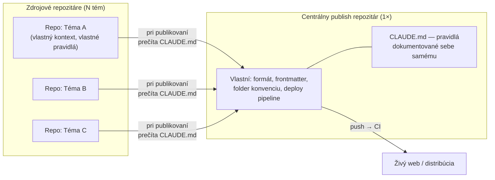

---
# 🧩 Versioning – systém dopĺňa automaticky
fm_version: "1.0.1"

# Dátum buildu – generuje skript
fm_build: "2026-09-15T08:36:07.810614+00:00"

# Poznámka k verzii – voliteľné
fm_version_comment: ""

# 🆔 IDENTITY --------------------------------------------------------

# ID generuje CLI / skript
id: "K000118"

# Unikátne UUID – generuje skript
guid: "d6d5dbe3-26a9-43ed-8d96-6671c2e17168"

# 🧭 CONTEXT ---------------------------------------------------------

# DAO / doména (knife, sdlc, q12, 7ds...) dopĺňa skript
dao: "knife"

# Názov zápisu – dopĺňa používateľ
title: "K000118 – Centrálny publish repozitár: SSOT pre viacero zdrojových tém"

# Krátky popis – dopĺňa používateľ (voliteľné)
description: "Ako štandardizovať publikovanie z ľubovoľného interného/zdrojového repozitára do jedného centrálneho publish kanála — cieľový repozitár vlastní svoj formát, konvencie aj deploy a dokumentuje ich sám sebe (CLAUDE.md), nie žiadnemu konkrétnemu zdroju. Univerzálny vzor pre tvorcov, ktorí pracujú na mnohých témach, ale publikujú cez jeden dedikovaný kanál."

# 👥 AUTHORSHIP ------------------------------------------------------

# Hlavný autor – z globálneho configu
author: "Roman Kazicka"

# Zoznam autorov – generuje skript
authors:
  - "Roman Kazicka"

# 🗂 CLASSIFICATION ---------------------------------------------------

# Nadradená kategória – môže doplniť používateľ
category: "KNIFE"

# Typ dokumentu (guide, case, tutorial...) – používateľ (voliteľné)
type: "pattern"

# Priorita (low/medium/high) – voliteľné
priority: "medium"

# Tagy – odporúča sa 2–6 tagov.
# Typy tagov:
#   - rámce: knife, 7ds, sdlc, q12
#   - účel: tutorial, guide, pattern, case-study
#   - téma: git, backup, ai, communication
#   - úroveň: beginner, intermediate, advanced
tags: ["publishing", "ssot", "architecture", "multi-repo", "automation"]

# 🌍 LOCALIZATION -----------------------------------------------------

# Jazyk dokumentu – doplní skript podľa štruktúry
locale: "sk"

# 🕒 LIFECYCLE --------------------------------------------------------

# Dátum vytvorenia – generuje skript
created: "2026-09-15 10:36"

# Dátum poslednej úpravy – dopĺňa človek
modified: "2026-09-15 10:36"

# Stav dokumentu – default "backlog"
status: "published"

# Viditeľnosť – default "public"
privacy: "public"

# ⚖ INTELLECTUAL PROPERTY -------------------------------------------

# Držiteľ práv k obsahu – dopĺňa skript
rights_holder_content: "Roman Kazicka"

# Systémový vlastník práv
rights_holder_system: "CAA / KNIFE / LetItGrow"

# Licencia
license: "CC-BY-NC-SA-4.0"

# Disclaimer
disclaimer: "Use at your own risk. Methods provided as-is; participation is voluntary and context-aware."

# Copyright
copyright: "© 2025 Roman Kazicka"

# 🔗 ORIGIN / PROVENANCE ---------------------------------------------

# Repozitár pôvodu
origin_repo: "knifes_overview-03"

# URL pôvodného repozitára
origin_repo_url: ""

# Commit pôvodu
origin_commit: ""

# Branch pôvodu
origin_branch: "main"

# Systém pôvodu (CAA/KNIFE/STHDF…)
origin_system: "CAA"

# Pôvodný autor
origin_author: "Roman Kazicka"

# Importovaný zdroj
origin_imported_from: ""

# Dátum importu
origin_import_date: ""

# 🧱 RESERVED ---------------------------------------------------------

fm_reserved1: ""
fm_reserved2: ""
---

> **KNIFE** – Knowledge In Friendly Examples
> **Séria:** Systemic Thinking in IT & Digital Fabrication
> **Úroveň:** Intermediate
> **Tagy:** `publishing` `ssot` `architecture` `multi-repo` `automation`

## 🎯 Čo rieši (účel, cieľ)

Tvorca (človek aj AI agent) zvyčajne pracuje na mnohých témach naraz,
každá vo svojom vlastnom internom/zdrojovom repozitári — vlastný
kontext, vlastné pravidlá, vlastný jazyk. Ale publikuje to všetko cez
**jeden dedikovaný kanál**: blog, dokumentačný web, KNIFE repozitár,
firemný wiki.

Bez štandardu vzniká jeden z dvoch problémov:

1. **Pravidlá publikovania sa duplikujú** v každom zdrojovom
   repozitári zvlášť (a časom sa rozídu — jeden zdroj vie o novom
   frontmat poli, druhý nie).
2. **Pravidlá publikovania existujú len v hlave človeka** (alebo v
   kontexte jednej konkrétnej AI session) — každý ďalší tvorca/session,
   čo príde zvonka, si tie isté chyby vytrpí znova.

Tento KNIFE popisuje vzor, ktorý oba problémy odstraňuje: **cieľový
(publish) repozitár vlastní a dokumentuje svoje vlastné pravidlá —
sebe samému, nie žiadnemu konkrétnemu zdroju.**

## 🧩 Ako to rieši (princíp)

Rozdeľ svet na dve jasne oddelené role:

**Kľúčová inverzia zodpovednosti**: znalosť "ako sa sem má správne
publikovať" nepatrí zdrojovému repozitáru (ten o cieli nemusí vedieť
nič viac než "kam to pošlem"), ale **cieľovému repozitáru** — presne
tak, ako README kedysi existovalo pre ľudí, čo do repozitára prišli
zvonka. `CLAUDE.md` (alebo ekvivalent pre iný nástroj) robí to isté
pre AI agenta: dokumentuje frontmatter schému, štruktúru obsahu, ktoré
vzory fungujú a ktoré empiricky zlyhali, a ako sa to deployuje — na
mieste, kde sa to reálne použije, nie v pamäti jednej session.

Tri pravidlá, ktoré z toho vyplývajú:

1. **Publish repozitár je autoritatívny nad vlastným formátom.**
   Zdrojový repozitár sa neháda o tom, ako má vyzerať frontmatter v
   cieli — len tam príde a spýta sa (prečíta `CLAUDE.md`).
2. **Empirické poučky sa zapisujú do cieľa, nie do zdroja.** Ak sa pri
   publikovaní niečo pokazí (build zlyhá, asset sa nenačíta), oprava aj
   poučenie patrí do `CLAUDE.md` cieľového repozitára — nabudúce to
   nebude musieť znova objaviť ani ten istý zdroj, ani iný.
3. **Deploy je vlastníctvo cieľa, nie zdroja.** CI/CD trigger (napr.
   push na `main` → build → publikovanie) žije v publish repozitári.
   Zdrojový repozitár nikdy nemusí vedieť, ako sa výsledný web buduje.

## 🧪 Ako to použiť (aplikácia)

**Krok za krokom, keď máš nový zdrojový repozitár/tému:**

1. **Over, či centrálny publish repozitár existuje** a má `CLAUDE.md`
   (alebo rovnocenný dokument). Ak nie, over najprv, či fakt niet
   iného — než založíš druhý, over si to s vlastníkom.
2. **Pracuj vo svojom zdrojovom repozitári bežne** — vlastný kontext,
   vlastná pamäť, vlastné pravidlá pre danú tému. Nič z toho sa
   nemieša do publish repozitára.
3. **Keď je čo publikovať, otvor/cd do publish repozitára** a nechaj
   nástroj (Claude Code alebo iný agent) prečítať jeho `CLAUDE.md` —
   to je bod, kde sa "naučí" presne to, čo treba: frontmatter šablónu,
   scaffold nástroj, konvenciu assetov, deploy mechanizmus.
4. **Commituj a pushni priamo v publish repozitári.** Ak má CI trigger
   na push (bežné), tým je publikovanie hotové — žiadny manuálny
   deploy krok navyše.
5. **Ak pri publikovaní narazíš na niečo nové** (nefunkčný vzor,
   chýbajúce pravidlo), zapíš poučenie **do `CLAUDE.md` publish
   repozitára**, nie do zdrojového repozitára ani len do vlastnej
   pamäte — inak bude mať hodnotu len pre teba a len raz.

**Konkrétny príklad z praxe** (tento repozitár, `knifes_overview-03`):
je to centrálny publish kanál pre KNIFE zápisy naprieč viacerými
témami — BaZi engine, enterprise architektúra, platby, a teraz aj
"Systemic Thinking in IT & Digital Fabrication". Pri prvom pokuse o
publikovanie KNIFE o platobných bránach (K000117) vznikla chyba presne
opačným smerom, než tento vzor odporúča — zápis vznikol najprv v
**privátnom zdrojovom** repozitári namiesto verejného publish
repozitára ("aha ja som myslel knife do iného repozitára nie
privátneho"). Náprava = presun do správneho cieľa + over konvencie
priamo tam (K000116/K000111 ako referencia). O pár dní neskôr, keď sa
počas publikovania toho istého K000117 objavili tri reálne
Docusaurus/MDX chyby (CSS string namiesto JS objektu v `style`, raw
HTML assety sa neprocesujú), poučenie sa nezapísalo do zdrojového
repozitára ani len do pamäte jednej session — zapísalo sa priamo do
`CLAUDE.md` tohto publish repozitára. Odvtedy ho automaticky dostane
každá ďalšia session, čo sem príde publikovať — bez ohľadu na to, z
akého zdrojového projektu prišla.

## ✅ Hodnota / Zhrnutie

Škáluje sa to na N zdrojových tém/tvorcov bez toho, aby existovalo N
kópií "ako sa publikuje" — pravidlo je napísané raz, na mieste, kde sa
reálne použije, a čítané zakaždým nanovo namiesto spoliehania sa na
pamäť konkrétneho človeka alebo konkrétnej AI session. Onboarding novej
témy je potom len: "začni vo svojom repozitári, keď je čo publikovať,
prečítaj si `CLAUDE.md` cieľa."

## Zdroje

Vzniknuté priamo z reálnej skúsenosti pri publikovaní K000117
(2026-09-10 až 2026-09-15) — zámena zdrojového a cieľového
repozitára, tri Docusaurus/MDX build chyby a ich zápis do
`CLAUDE.md` tohto repozitára ako opakovateľné poučenie pre budúce
publikovanie z ľubovoľného zdroja.

<!-- body:start -->

<!-- nav:knifes -->
> [⬅ KNIFES – Prehľad](../knifes_overview/KNIFE_Overview_Blog.md) • [Zoznam](../knifes_overview/KNIFE_Overview_List.md) • [Detaily](../knifes_overview/KNIFE_Overview_Details.md)
