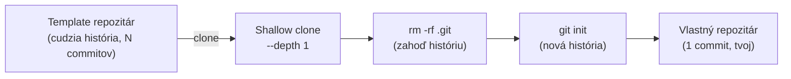

---
# 🧩 Versioning – systém dopĺňa automaticky
fm_version: "1.0.1"

# Dátum buildu – generuje skript
fm_build: "2026-09-16T07:04:38.232413+00:00"

# Poznámka k verzii – voliteľné
fm_version_comment: ""


# 🆔 IDENTITY --------------------------------------------------------

# ID generuje CLI / skript
id: "K000119"

# Unikátne UUID – generuje skript
guid: "0bc5a961-542b-49f6-8369-eade63c10a43"


# 🧭 CONTEXT ---------------------------------------------------------

# DAO / doména (knife, sdlc, q12, 7ds...) dopĺňa skript
dao: "knife"

# Názov zápisu – dopĺňa používateľ
title: "K000119 – Ako si vytvoriť čistý klon triedneho repozitára"

# Krátky popis – dopĺňa používateľ (voliteľné)
description: "Ako si z ľubovoľného triedneho/tímového template repozitára urobiť vlastný, čistý klon bez cudzej histórie — jeden štandardný postup namiesto toho, aby si to každý riešil (alebo kopíroval nesprávne) po svojom. Aplikované na štart repozitára pre predmet STHDF 2026-2027."


# 👥 AUTHORSHIP ------------------------------------------------------

# Hlavný autor – z globálneho configu
author: "Roman Kazicka"

# Zoznam autorov – generuje skript
authors:
  - "Roman Kazicka"


# 🗂 CLASSIFICATION ---------------------------------------------------

# Nadradená kategória – môže doplniť používateľ
category: "KNIFE"

# Typ dokumentu (guide, case, tutorial...) – používateľ (voliteľné)
type: "tutorial"

# Priorita (low/medium/high) – voliteľné
priority: "medium"

# Tagy – odporúča sa 2–6 tagov.
# Typy tagov:
#   - rámce: knife, 7ds, sdlc, q12
#   - účel: tutorial, guide, pattern, case-study
#   - téma: git, backup, ai, communication
#   - úroveň: beginner, intermediate, advanced
tags: ["git", "tutorial", "onboarding", "template", "beginner"]


# 🌍 LOCALIZATION -----------------------------------------------------

# Jazyk dokumentu – doplní skript podľa štruktúry
locale: "sk"


# 🕒 LIFECYCLE --------------------------------------------------------

# Dátum vytvorenia – generuje skript
created: "2026-09-16 09:04"

# Dátum poslednej úpravy – dopĺňa človek
modified: "2026-09-16 09:04"

# Stav dokumentu – default "backlog"
status: "published"

# Viditeľnosť – default "public"
privacy: "public"


# ⚖ INTELLECTUAL PROPERTY -------------------------------------------

# Držiteľ práv k obsahu – dopĺňa skript
rights_holder_content: "Roman Kazicka"

# Systémový vlastník práv
rights_holder_system: "CAA / KNIFE / LetItGrow"

# Licencia
license: "CC-BY-NC-SA-4.0"

# Disclaimer
disclaimer: "Use at your own risk. Methods provided as-is; participation is voluntary and context-aware."

# Copyright
copyright: "© 2025 Roman Kazicka"


# 🔗 ORIGIN / PROVENANCE ---------------------------------------------

# Repozitár pôvodu
origin_repo: "knifes_overview-03"

# URL pôvodného repozitára
origin_repo_url: ""

# Commit pôvodu
origin_commit: ""

# Branch pôvodu
origin_branch: "main"

# Systém pôvodu (CAA/KNIFE/STHDF…)
origin_system: "CAA"

# Pôvodný autor
origin_author: "Roman Kazicka"

# Importovaný zdroj
origin_imported_from: ""

# Dátum importu
origin_import_date: ""


# 🧱 RESERVED ---------------------------------------------------------

fm_reserved1: ""
fm_reserved2: ""
---

# Ako si vytvoriť čistý klon triedneho repozitára

> **KNIFE** – Knowledge In Friendly Examples
> **Séria:** Systemic Thinking in IT & Digital Fabrication
> **Úroveň:** Beginner
> **Tagy:** `git` `tutorial` `onboarding` `template` `beginner`

## ⚡ Rýchly návod (Top)

```bash
git clone --depth 1 <URL-sablony> <moj-priecinok>
cd <moj-priecinok>
rm -rf .git
git init
git add -A
git commit -m "Initial commit"
```

Výsledok: `<moj-priecinok>/` je nový, samostatný git repozitár s jedným
commitom — celý obsah šablóny, žiadna jej história.

## 🎯 Čo rieši (účel, cieľ)

Keď niekto dostane príkaz "sprav si klon tohto repozitára", najprirodzenejšia
reakcia je `git clone <url>`. Problém: to neprenesie len obsah, ale **celú
históriu** zdrojového repozitára — každý commit, každú správu, každého
autora, ktorý kedy na šablóne pracoval.

Pri jednorazovom template repozitári to spôsobí tri reálne problémy:

1. **Cudzia história v tvojom repozitári.** `git log` ukazuje commity
   niekoho iného, nie tvoju prácu — orientácia aj `git blame` sú od
   začiatku znečistené.
2. **Skrytý vzťah k pôvodnému repu.** Klon si ponecháva `origin` smerujúci
   na šablónu — ľahko sa stane, že niekto omylom pushne (alebo sa pokúsi
   pushnúť) do cudzieho repozitára namiesto vlastného.
3. **Bez štandardu si to každý vyrieši inak** — alebo skopíruje zlý
   postup od niekoho iného. Presne to je dôvod, prečo je toto KNIFE,
   nie len jednorazová poznámka: raz zapísaný postup sa dá odovzdať
   ďalej — od učiteľa študentom, aj neskôr medzi študentami navzájom.

## 🧩 Ako to rieši (princíp)



Tri kroky, každý s jasným dôvodom:

1. **`git clone --depth 1`** — stiahne len aktuálny stav súborov, nie
   celú históriu (rýchlejšie, menej dát, ale história sa aj tak
   preberie do `.git/`).
2. **`rm -rf .git`** — odstráni prevzatý `.git` adresár úplne. Týmto
   zmizne história aj prepojenie na `origin` šablóny.
3. **`git init` + `git add -A` + `git commit`** — založí úplne novú,
   prázdnu históriu s jediným commitom: "toto je môj štart".

## 🧪 Ako to použiť (aplikácia)

**Krok za krokom:**

1. **Over si URL šablóny**, ktorú ti dal učiteľ/tím lead.
2. **Zvoľ si názov priečinka podľa dohodnutej konvencie** — v predmete
   STHDF napr. `ST-042-MojeMeno` (individuálna práca) alebo
   `PRJ-017-NazovProjektu` (tímový projekt). Konvencia sa neskôr znova
   použije pri publikovaní výstupov, takže sa jej drž od začiatku.
3. **Spusti tri príkazy z Rýchleho návodu** vyššie.
4. **Založ si prázdny repozitár na GitHube** (bez README, bez
   `.gitignore` — tie už máš z klonu) a pripoj ho:

   ```bash
   git remote add origin <URL-tvojho-noveho-repozitara>
   git branch -M main
   git push -u origin main
   ```

5. **Over si, že `git remote -v` ukazuje TVOJ repozitár**, nie šablónu.

**Konkrétny príklad z praxe:** presne týmto postupom vznikol štart
repozitára pre nový ročník predmetu — `2026_sthdf_class_template` →
klon → `class_sthdf_2026-2027`, s jedným "Initial commit" namiesto
prevzatej histórie desiatok predchádzajúcich iterácií šablóny.

## 📜 Detailný článok

**Prečo nie obyčajný `git clone`?** Bez `--depth 1` a bez následného
vyčistenia `.git/` zdedíš všetko — vrátane vecí, ktoré v šablóne nemuseli
byť určené na verejné šírenie (staré poznámky, rozpracované commity,
mená predchádzajúcich autorov). Pri jednorazovom štarte nového projektu
to nemá žiadnu hodnotu, len šum a riziko.

**Prečo nie `degit` alebo iný špecializovaný nástroj?** Existujú nástroje
(napr. `npx degit`), ktoré robia presne toto v jednom príkaze. Zámerne tu
ale ide o postup **len s holým gitom** — funguje všade, kde je git
nainštalovaný, bez závislosti na Node.js/npm alebo inom runtime. Pre
skupinu, kde nie každý má rovnaké vývojové prostredie, je to
spoľahlivejší spoločný menovateľ.

**Prečo `rm -rf .git` a nie napr. `git checkout --orphan`?** `--orphan`
vytvorí novú vetvu bez rodičov, ale pôvodné commity zostávajú v
repozitári dosiahnuteľné (kým ich `git gc` nezmaže) a `origin` zostáva
nastavený na šablónu. `rm -rf .git` + `git init` je jednoznačnejšie:
po tomto kroku v priečinku neexistuje žiadna stopa po pôvodnom
repozitári.

## 💡 Tipy a poznámky

- **Priečinok už existuje?** `git clone` odmietne klonovať do
  neprázdneho priečinka — over si názov vopred, alebo klonuj do dočasného
  mena a premenuj.
- **Zabudol si `rm -rf .git`?** Spoznáš to podľa toho, že `git log`
  ukazuje cudzie commity. Over si to hneď po klone (`git log --oneline`
  by mal ukázať len históriu šablóny, kým `git init` ešte nespravíš).
- **`git push` zlyhá s "Permission denied"?** Skontroluj `git remote -v`
  — ak stále ukazuje na šablónu namiesto tvojho repozitára, `.git` sa
  nevymazal správne.
- **Windows:** postup funguje rovnako v Git Bash; `rm -rf .git` vo
  PowerShell nahraď `Remove-Item -Recurse -Force .git`.

## ✅ Hodnota / Zhrnutie

Tri príkazy namiesto opakovaného vysvetľovania naživo — a hlavne
**jeden zapísaný, opakovateľný postup** namiesto toho, aby si ho každý
študent (alebo každý nový ročník) objavoval nanovo, prípadne prevzal
nesprávnu verziu od spolužiaka. Funguje pre ľubovoľný template
repozitár, nielen pre STHDF — je to všeobecný vzor onboardingu do
nového projektu.

## Zdroje

Vzniknuté priamo z prípravy `2026_sthdf_class_template` pre ročník
STHDF 2026-2027 (repozitár `06-STH-Projects/2026_sthdf_class_template`,
skript `tools/clone-student-template.sh`) — zapísané ako samostatné
KNIFE, aby bol postup prenositeľný aj mimo tohto jedného predmetu.

<!-- body:start -->

<!-- nav:knifes -->
> [⬅ KNIFES – Prehľad](../knifes_overview/KNIFE_Overview_Blog.md) • [Zoznam](../knifes_overview/KNIFE_Overview_List.md) • [Detaily](../knifes_overview/KNIFE_Overview_Details.md)
---
