# GitHub Education Faculty Benefits – Usage Scenario

Tento návod popisuje, čo robiť po schválení GitHub Education Faculty Benefits.

## ✅ Status
- Schválené: **August 26, 2025**
- Platnosť do: **August 26, 2027**
- Typ: **Faculty**

---

## 1. Aktivácia Team plánu pre organizácie
1. Prejdi do svojej organizácie (`SystemThinking`, `STHDF-2025-2026`, ...).
2. V menu klikni na **Settings → Billing**.
3. Nájdeš tam možnosť **Upgrade to Team for free via GitHub Education**.
   https://education.github.com/globalcampus/teacher

4. Aktivuj – odteraz má organizácia **GitHub Team plan zadarmo**.

<a href="./img/activation/GH-UpgradeToGHTEAM.png" title="Upgrade to GitHub Team">
  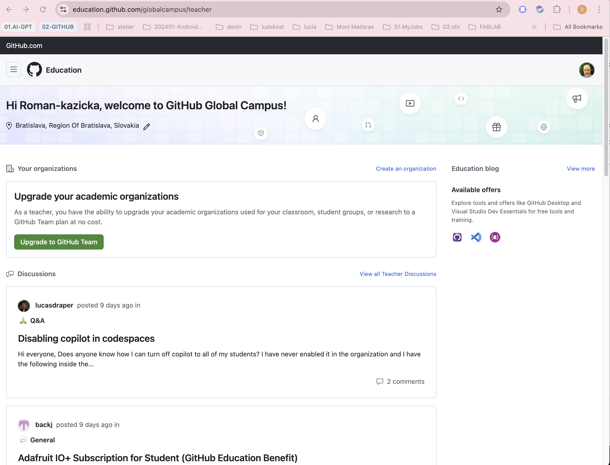
</a>

### Kontrola aktivácie
- Na screenshote je vidno 0€/mesiac, inak by tam bolo 4€/mesiac
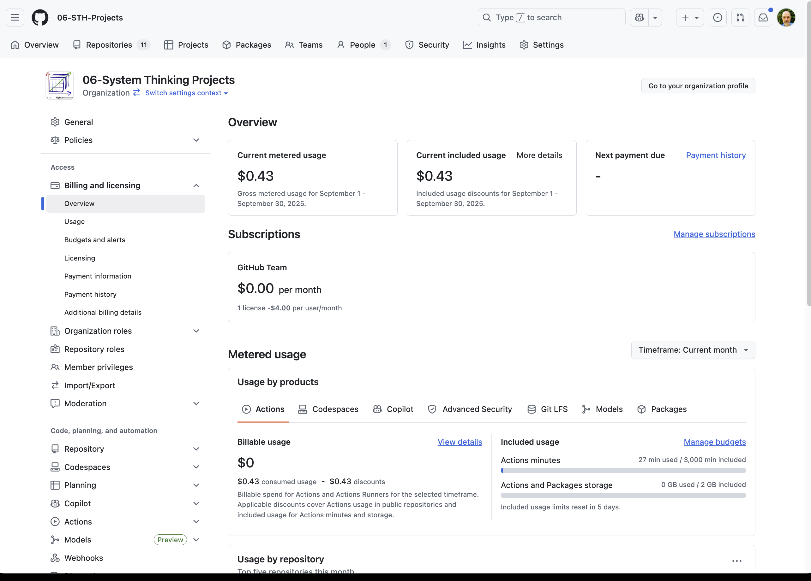
- Využitie podľa repozitárov
 
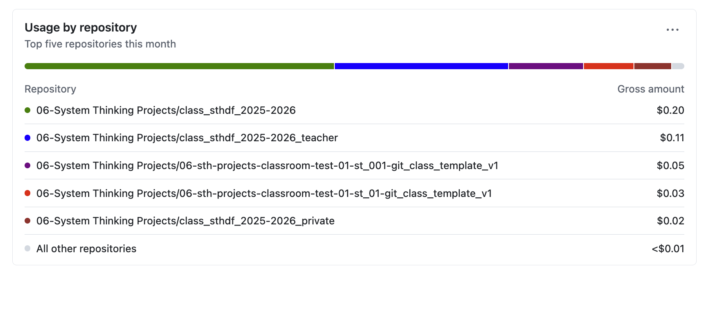
Vidno, že poplatky za používanie nejaké sa priebežne počítajú, ale mne sa nebudú účtovať, lebo benefity.
---

## 2. Aktivácia Copilot Pro kupónu

1. Vráť sa do [Education Benefits](https://github.com/settings/education/benefits)

2. Klikni na odkaz „To redeem your Copilot Pro coupon, please sign up via this link“.

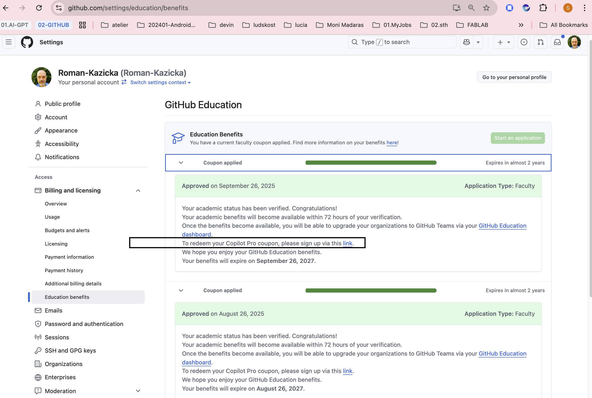
   
3. Upgrade to Copilot Team.

1. Copilot - step 01

    <a href="./img/activation/Copilot-01.png" title="Copilot-01">
    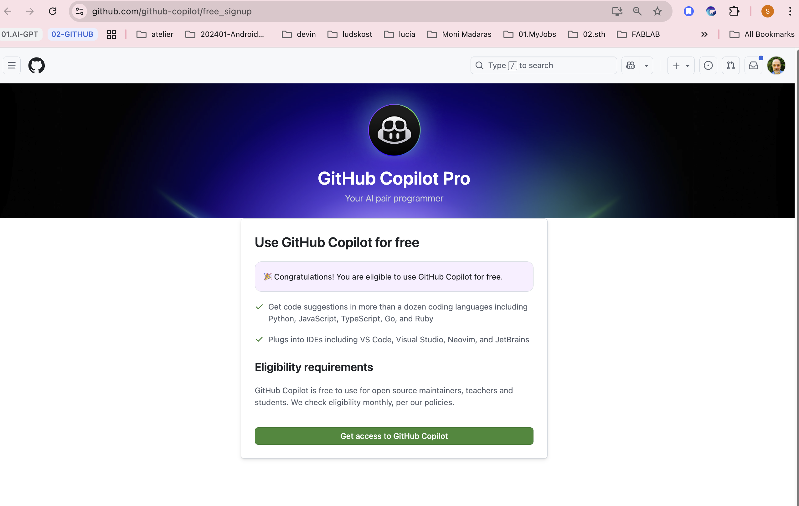
</a>

1. Copilor - step 02
   

       <a href="./img/activation/Copilot-02.png" title="Copilot-02">
       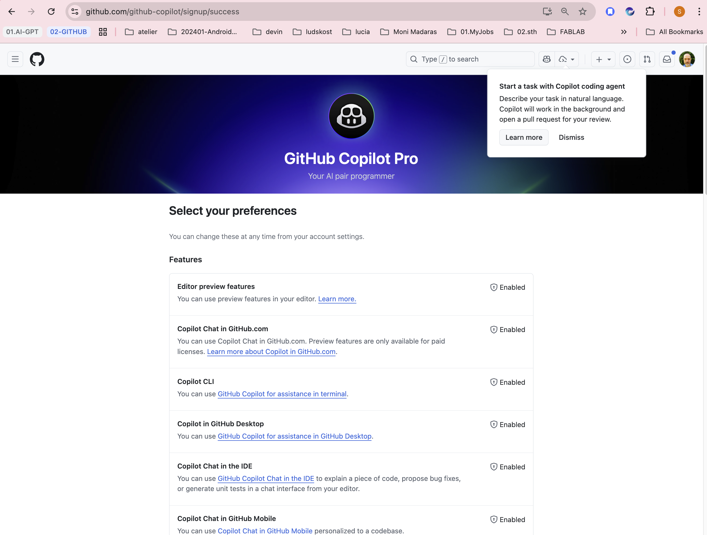
       </a>
    

2. Copilot - Step 03
    

       <a href="./img/activation/Copilot-03.png" title="Copilot-03">
       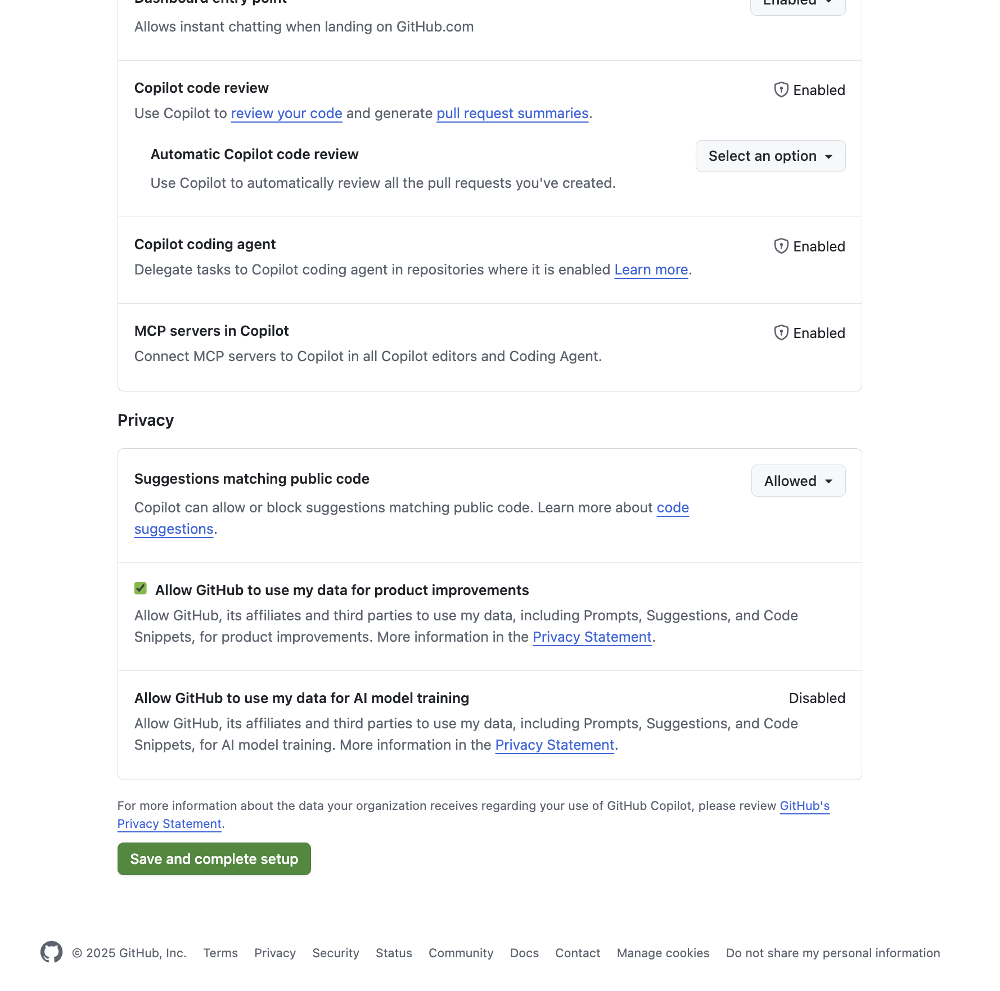
       </a>
    

4. Copilot - Step 04
   

       <a href="./img/activation/Copilot-04.png" title="Copilot-04">
       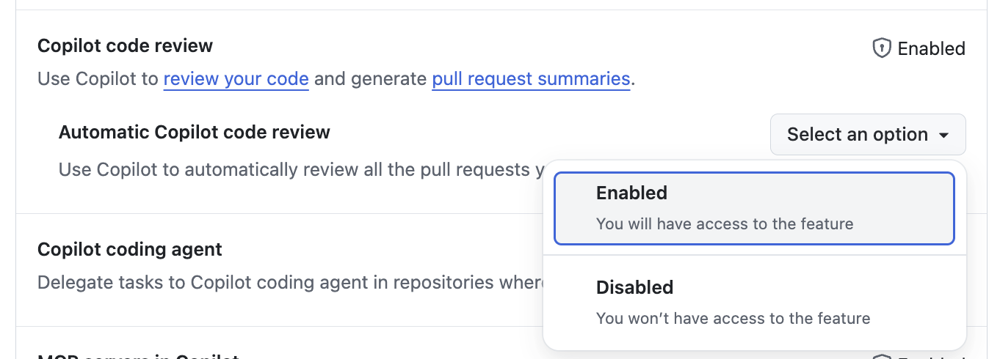
       </a>
    

6. Copilot - Step 05
    

       <a href="./img/activation/Copilot-05.png" title="Copilot-05">
       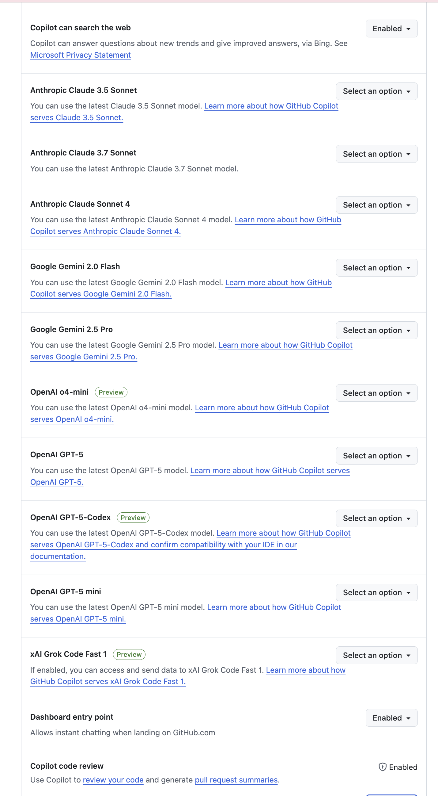
       </a>
    

8. Copilot - Step 06
    

       <a href="./img/activation/Copilot-05-IDE.png" title="Copilot-06">
       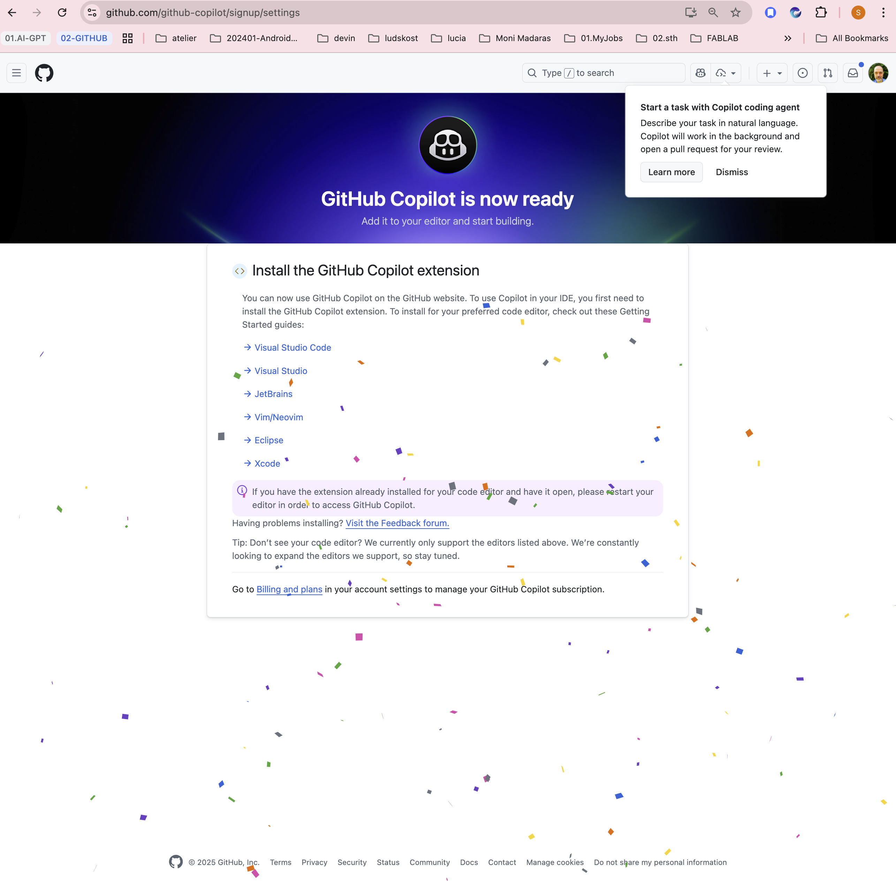
       </a>
    

10. Copilot - Step 07
    

       <a href="./img/activation/Copilot-07-VSC.png" title="Copilot-07">
       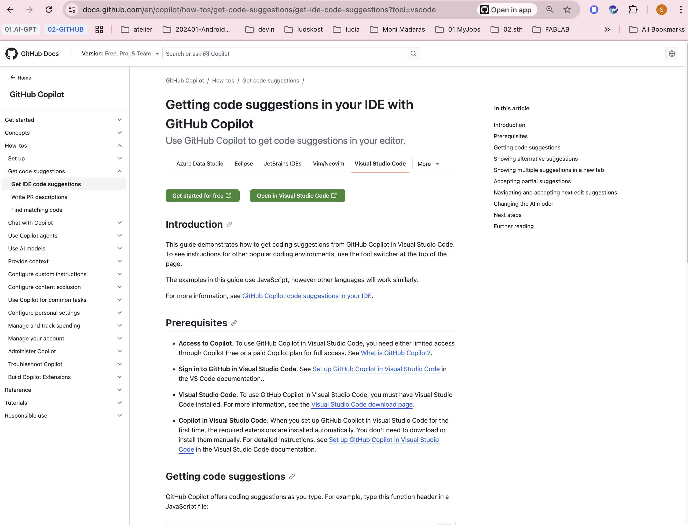
       </a>
    

# Získané vlastnosti
https://github.com/settings/copilot/features

---

## 3. Kontrola statusu
- Prejdi na [https://github.com/settings/education/benefits](https://github.com/settings/education/benefits).
- Mal by svietiť zelený status **Approved**.

---

# 🎉 Výhody po aktivácii
- GitHub Team plan pre organizácie zdarma (private repo, Actions minutes, Pages builds)
- Copilot Pro pre teba a možnosť kupónov pre študentov
- Partnerské benefity (JetBrains, Canva EDU, DigitalOcean credits ...)

---

# 📌 Ďaľšie informácie

https://docs.github.com/en/copilot

    <a href="./img/activation/Copilot-08-Documentation.png" title="Copilot-08-Documentation">
    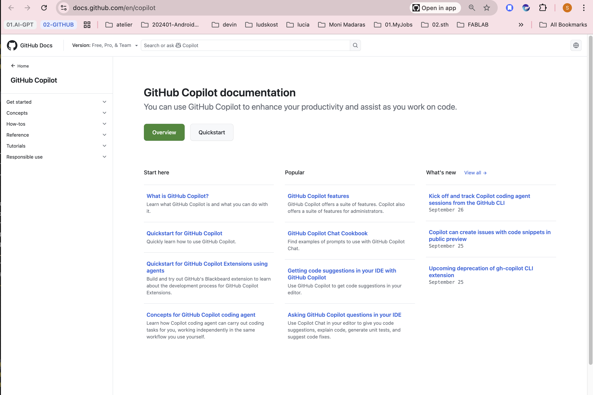
</a>

