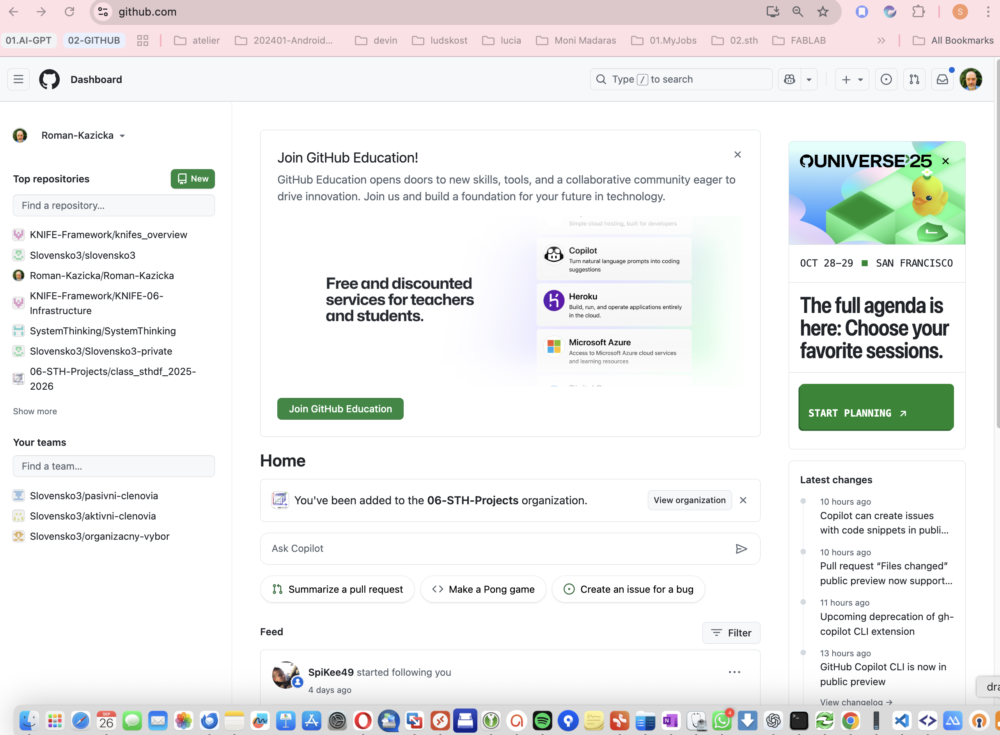
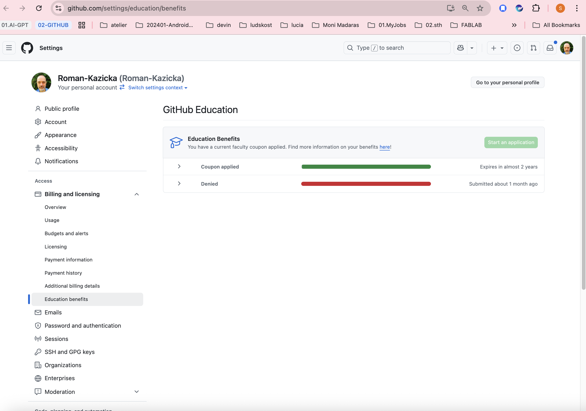

<!-- body:start -->

<!-- nav:knifes -->
> [⬅ KNIFES – Prehľad](../overview.md)
---
# KNIFE K084 – Ako aktivovať na GitHube EDU benefity

## 🎯 Čo rieši (účel, cieľ)
- GitHub ponúka špeciálne benefity aj pre vzdelávacie inštitúcie prostredníctvom učiteľov.
- Učiteľ musí najprv požiadať o udelenie prístupu k benefiom
- https://github.com/education 

- https://education.github.com/benefits.

## 🧩 Ako to rieši (princíp)

- aktivácia benefitov je proces so schvaľovaním

## 🧪 Ako to použiť (aplikácia)

---

## ⚡ Rýchly návod (Top)

## 📜 Detailný článok
[Ako si aktivovať prístup ku EDU benefitom](./GHEDU_Faculty_Benefits.md)
## 💡 Tipy a poznámky

## ✅ Hodnota / Zhrnutie
